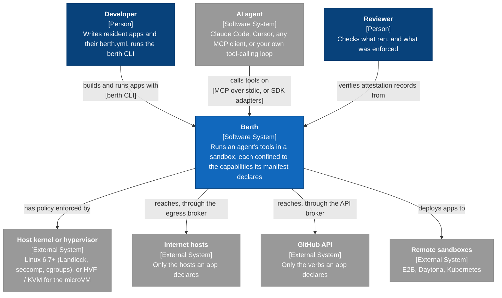
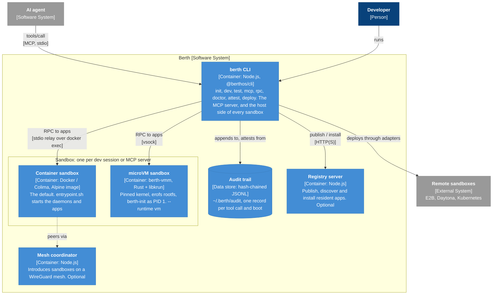
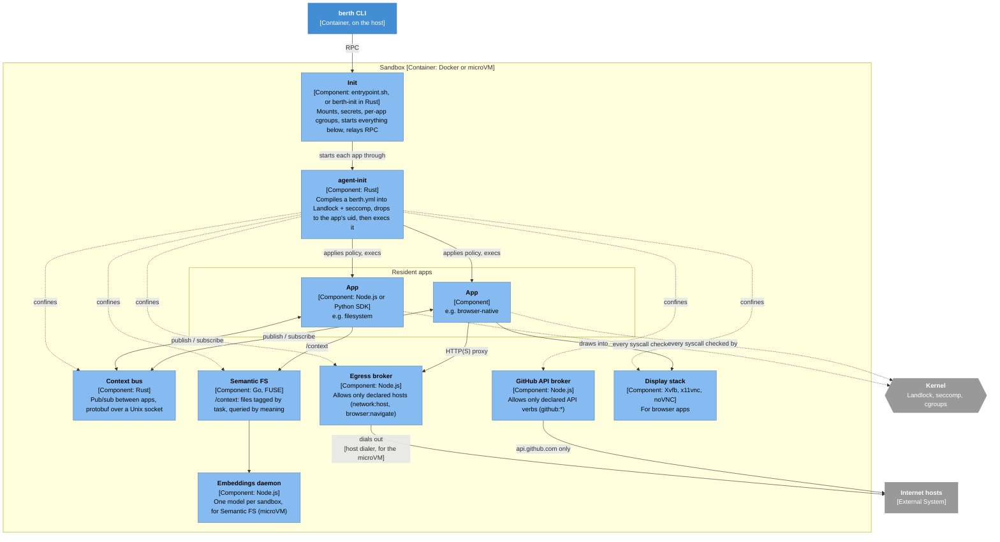

# BerthOS

**Your agent decides what to call. Berth decides what those calls can touch, and the Linux kernel enforces it.**

Agents act through tools: a filesystem, a shell, a browser, a code interpreter. Berth runs those tools in a sandbox and gives each one a manifest listing exactly what it may touch. Before the tool's first line of code runs, the manifest is compiled into kernel rules. So when a prompt-injected model tries to write outside its folder, it isn't talked out of it by a system prompt. The write fails with `EACCES`.

Keep your agent and keep your framework. Berth sits underneath the tools.

This README is laid out along the [C4 model](https://c4model.com): the [system in its context](#level-1-system-context), the [containers](#level-2-containers) it runs as, the [components](#level-3-components-inside-a-sandbox) inside a sandbox, and the [code](#level-4-code) you write against it. If you only want to see it work, start with the demo.

## See it in 60 seconds

No API key and no LLM needed: this demo calls the tool directly, the way an agent would.

```bash
git clone https://github.com/Ash20pk/BerthOS && cd BerthOS
corepack enable && pnpm install && pnpm build
node packages/cli/bin/berth.js doctor --fix     # can this machine's kernel enforce anything?
cd examples/kernel-says-no && pnpm start
```

```
--- inside the declared scope ---
write /workspace/hello.txt -> ok, read back: "hello from a sandbox"

--- outside the declared scope ---
write /etc/berth-should-not-exist.txt -> EACCES: permission denied, open '/etc/berth-should-not-exist.txt'

PASS — the capability line in berth.yml is the boundary, and the kernel is the one holding it.
```

Nothing in that script, or in the app's own code, checks the second path. The kernel refused it.

> **On a Mac, run `doctor` first.** Docker Desktop's VM has no Landlock, so nothing would be enforced, and the demo says so and exits non-zero rather than faking a pass. `berth doctor --fix` sets up a [Colima](./docs/mac-enforcement.md) VM whose kernel can enforce, or use the [microVM runtime](./docs/local-vm.md), which boots Berth's own kernel. Linux 6.7+ works out of the box.

More demos, each proving one boundary: a [fully compromised model](./examples/prompt-injection) told to backdoor `/etc`, [attacker-chosen code with no network](./examples/no-egress), and a [tamper-evident audit trail](./examples/audit-trail) catching an edited record. See the [catalog](./examples/README.md).

## Level 1: System context

Who uses Berth, and what it touches.



Your agent is outside the system boundary on purpose: Berth doesn't run it, prompt it or wrap it. It sees ordinary tools.

### Plug in the agent you already have

**Any MCP client, no code.** `berth mcp` is an MCP server. It boots the sandbox itself, exposes the app's exports as tools, and shuts the sandbox down when your client disconnects.

```bash
node packages/cli/bin/berth.js mcp --app filesystem --app-dir apps/filesystem --warm   # build the image once

claude mcp add berth-filesystem -- node /abs/path/BerthOS/packages/cli/bin/berth.js \
  mcp --app filesystem --app-dir /abs/path/BerthOS/apps/filesystem
```

Ask your agent to write to `/etc` and it gets back a denial that tells it why, not just an error code:

```
BERTH CAPABILITY DENIAL
denied: open(2) on /etc/berth-should-not-exist.txt (EACCES: permission denied)
denied-by: the kernel — a Landlock ruleset compiled from "filesystem"'s berth.yml, applied before the app's first line ran
fix: none available — a berth.yml filesystem scope may only name /workspace, /context, /tmp, /app
```

Setup for Claude Desktop, Cursor and Colima: [MCP quickstart](./docs/mcp-quickstart.md).

**Your own tool-calling loop.** Boot a sandbox, hand its tools to the loop you already run. This path works from a clone for now: `Computer` and the adapters live in the [experimental agent framework](./experimental), which isn't published. Moving them into their own package is [on the roadmap](./ROADMAP.md#now).

```ts
import { openai } from "@ai-sdk/openai";
import { generateText, stepCountIs } from "ai";
import { Computer, toAiSdkTools } from "@berthos/agents";

const computer = await Computer.boot({ apps: ["apps/filesystem"] });
const tools = await toAiSdkTools(computer.tools);

await generateText({
  model: openai("gpt-4o"),
  tools,
  stopWhen: stepCountIs(5),
  prompt: "Write a summary to /workspace/notes.md",
});
await computer.stop();
```

| Your stack | Call |
|---|---|
| Vercel AI SDK | `toAiSdkTools(computer.tools)` |
| LangChain / LangGraph | `toLangChainTools(computer.tools)` |
| Anything else | `toToolSpecs(computer.tools)`: name, description, JSON Schema, and a call function |

Both adapters are optional peer dependencies. Full example: [`examples/agents/with-vercel-ai-sdk`](./examples/agents/with-vercel-ai-sdk).

## Level 2: Containers

Zooming into Berth: the separately running pieces, and how they talk. "Container" here is C4's word for a runnable unit, not only a Docker container.



| Container | Code | What it does |
|---|---|---|
| berth CLI | [`packages/cli`](./packages/cli) | Every command; bundles apps, boots and stops sandboxes, speaks MCP, writes the audit trail, runs `attest` |
| Container sandbox | [`packages/docker-orchestrator`](./packages/docker-orchestrator) | Alpine base image, container lifecycle, hot reload, snapshots. The default runtime |
| microVM sandbox | [`packages/vmm`](./packages/vmm) | `berth-vmm` boots a libkrun VM (HVF on macOS) from a pinned kernel and rootfs, with no network device; egress only through a dialer on the host. See [the microVM runtime](./docs/local-vm.md) |
| Audit trail | [`packages/audit`](./packages/audit) | Structured records with a hash chain and payload redaction; [reference](./docs/audit-reference.md) |
| Registry server | [`packages/registry-server`](./packages/registry-server) | Local app registry; [reference](./docs/app-registry-reference.md) |
| Mesh coordinator | [`packages/mesh-coordinator`](./packages/mesh-coordinator) | Stable mesh IPs and mutual peer matching; [reference](./docs/mesh-reference.md) |
| Deploy adapters | [`packages/adapters`](./packages/adapters) | One `DeployAdapter` interface, implemented for E2B, Daytona and Kubernetes |

Both sandboxes run the same apps under the same policy. The microVM adds a second wall, a hypervisor boundary around the whole sandbox, and brings its own kernel, so enforcement doesn't depend on the host's.

## Level 3: Components inside a sandbox

Zooming into one sandbox. Every component runs as its own uid under its own Landlock and seccomp policy; only the init process runs as root, and only until the others are started.



The daemons start only when an app declares the capability that needs them: no `/context`, no Semantic FS; no `browser:*`, no display stack.

| Component | Code | Reference |
|---|---|---|
| Init | [`entrypoint.sh`](./packages/docker-orchestrator/docker/entrypoint.sh), [`packages/vmm/init`](./packages/vmm/init) (berth-init) | [Kernel enforcement](./docs/kernel-enforcement.md), [resource limits](./docs/resource-limits.md), [secrets](./docs/secrets-reference.md) |
| agent-init | [`packages/agent-init`](./packages/agent-init) | [Kernel enforcement](./docs/kernel-enforcement.md) |
| Context bus | [`packages/context-bus-daemon`](./packages/context-bus-daemon) | [Context bus](./docs/context-bus-reference.md) |
| Semantic FS | [`packages/semantic-fs-daemon`](./packages/semantic-fs-daemon) | [Semantic FS](./docs/semantic-fs-reference.md) |
| Egress broker | [`egress-broker.cjs`](./packages/docker-orchestrator/docker/egress-broker.cjs) | [Egress broker](./docs/egress-broker-reference.md) |
| GitHub API broker | [`github-api-broker.cjs`](./packages/docker-orchestrator/docker/github-api-broker.cjs) | [GitHub API scoping](./docs/github-api-scoping-reference.md) |
| Mesh daemon | [`packages/mesh-daemon`](./packages/mesh-daemon) | [Mesh](./docs/mesh-reference.md) |

### Resident apps in the box

| App | What it gives an agent | Declares |
|---|---|---|
| [`filesystem`](./apps/filesystem) | Read and write files | `filesystem:read/write:/workspace` |
| [`code-interpreter`](./apps/code-interpreter) | Run Python, JavaScript or shell | `filesystem:write:/workspace`, no network |
| [`terminal`](./apps/terminal) | A real shell you can watch live in the browser | `filesystem:write:/workspace` |
| [`browser-native`](./apps/browser-native) | Headless Chromium you can watch over VNC | `browser:navigate:*` |
| [`web-fetch`](./apps/web-fetch) | Call APIs and read web pages, on the hosts you list | `network:host:<host>`, one per host |
| [`git`](./apps/git) | Clone, branch, commit, diff, push and pull in the workspace, over HTTPS to the hosts you list | `filesystem:write:/workspace`, `network:host:github.com` |
| [`postgres`](./apps/postgres) | Query your PostgreSQL database; read-only by default | `network:host:<db>:5432`, a `DATABASE_URL` secret |
| [`mysql`](./apps/mysql) | Query your MySQL or MariaDB database; read-only by default | `network:host:<db>:3306`, a `DATABASE_URL` secret |
| [`github-assistant`](./apps/github-assistant) | Read repos, open issues | `github:read:repos`, `github:write:issues` |
| [`notes`](./apps/notes) | Stateful notes, persisted to disk | `filesystem:write:/workspace` |

Several apps can share one sandbox, and each keeps its own policy and its own uid.

## Level 4: Code

The code you write is a resident app: a manifest plus a handler. This is the whole of one.

```yaml
# berth.yml
name: hello-world
version: 0.1.0
capabilities: []          # touches nothing, so it can reach nothing
exports:
  - name: ping
    output: { message: string }
```

```ts
// src/index.ts
import { defineApp } from "@berthos/sdk";
import { z } from "zod";

export default defineApp((app) => {
  app.export({
    name: "ping",
    output: z.object({ message: z.string() }),
    handler: () => ({ message: "pong" }),
  });
});
```

```bash
berth init my-app && cd my-app
berth dev      # boots it in the sandbox, reloads on save
berth test     # checks the exports match the manifest and calls each one
```

How a capability line becomes a kernel rule, step by step:

1. **Declare.** `berth.yml` names the capabilities the app needs (`filesystem:write:/workspace`, `network:connect:443`) and the functions it exports. [`packages/manifest-schema`](./packages/manifest-schema) parses and validates it.
2. **Compile.** At boot, the capabilities become a policy file: write and read paths, ports, cgroup limits. Anything undeclared is denied by default: files, outbound connections, raw sockets.
3. **Enforce.** [`agent-init`](./packages/agent-init/src/main.rs) applies the policy as a Landlock ruleset and [seccomp filters](./packages/agent-init/src/seccomp.rs), drops to the app's uid, and only then execs the app.
4. **Connect.** The app's exports are served over RPC by the [SDK runtime](./packages/sdk) ([Python](./packages/sdk-python)), and show up in your agent as ordinary tools.

The rest is in [Resident apps](./docs/resident-apps.md), the [SDK reference](./docs/sdk-reference.md) and the [manifest reference](./docs/manifest-reference.md). The manifest format and the attestation record are also standalone, versioned specs: [capability manifest](./spec/capability-manifest), [attestation record](./spec/attestation-record).

## What it guarantees, and what it doesn't

- **Kernel-enforced:** filesystem read and write scopes, outbound TCP, UDP and raw sockets, namespace creation, and isolation between apps. This is real on any Linux 6.7+ kernel, and in the microVM, which boots its own kernel.
- **Broker-enforced:** browser hostnames and GitHub API verbs go through a proxy that checks them, because the kernel sees ports, not hostnames. Which capability is enforced at which level: [enforcement](./docs/kernel-enforcement.md).
- **It won't pretend.** On a kernel that can't enforce, `berth doctor` says so and the demos fail. Every `berth mcp` session writes its tool calls to a hash-chained audit trail, and `berth attest <runId>` turns a session into a record of what ran and the enforcement measured for its boot. Anyone can check the record with a standalone script, and it says `NOT_ENFORCED` when nothing was enforced.
- **Not a defence against root on the host.** Anyone who can `docker exec` into the container bypasses all of it. What's in scope and what isn't: [threat model](./docs/threat-model.md).

## Docs

| | |
|---|---|
| [MCP quickstart](./docs/mcp-quickstart.md) | Berth in Claude Code, Claude Desktop or Cursor in five minutes |
| [Quickstart](./docs/quickstart.md) | Install, run, scaffold, the CLI reference, releasing |
| [Resident apps](./docs/resident-apps.md) | Building your own tools |
| [microVM runtime](./docs/local-vm.md) | Running sandboxes in a microVM instead of Docker |
| [Enforcement](./docs/kernel-enforcement.md) | Every capability and what enforces it, per platform |
| [Threat model](./docs/threat-model.md) | What holds, against whom, and what's out of scope |
| [Roadmap](./ROADMAP.md) | What works today, what's next, and where to help |

Every subsystem has a reference page in [`docs/`](./docs), and design write-ups live in [`docs/design/`](./docs/design).

## Status

Early, and built by one maintainer, so expect APIs to move before 1.0. The sandbox publishes to npm as `@berthos/*` (`npm install -g @berthos/cli`) and to PyPI as `berthos-sdk`; the first-party apps, the demos and the experimental agent framework live in this repo. The unrelated `@berth/*` packages on npm belong to a different project.

Something not working? Run `berth doctor` first; it answers most "it built but nothing was enforced" reports in one line. Then [file a bug](./.github/ISSUE_TEMPLATE/bug_report.md), send [workflow feedback](./.github/ISSUE_TEMPLATE/workflow_feedback.md), or [pitch a resident app](./.github/ISSUE_TEMPLATE/resident_app_proposal.md). [CONTRIBUTING.md](./CONTRIBUTING.md) has the wishlist.

## License

Apache-2.0. See [LICENSE](./LICENSE).
