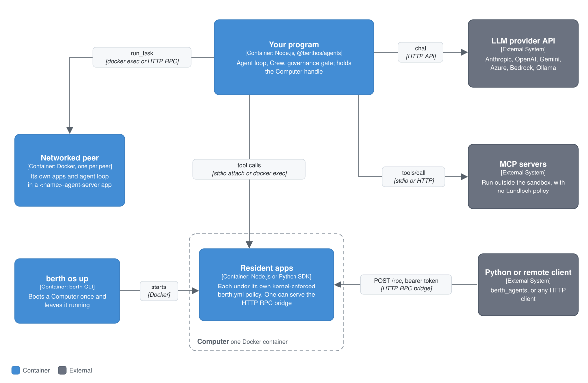

# Agent runtime reference

`@berthos/agents` is Berth's agent framework: boot a `Computer` (a sandbox loaded with resident apps), attach an `Agent` to it, and compose agents into crews. Every tool an agent calls is a resident-app export running under that app's kernel-enforced `berth.yml` policy. Bring any LLM provider.

> **Experimental, and not published.** The framework lives in [`experimental/`](../experimental/README.md) and is frozen: bug and security fixes only ([why](../CONTRIBUTING.md#the-agents-packages-are-frozen)). It isn't on npm. Use it from a clone of this repo, as a `"@berthos/agents": "workspace:*"` dependency. Releases ship the sandbox only. To put your own agent loop on Berth without this framework, use `berth mcp`, the [framework adapters](#using-berth-tools-from-another-framework), or the [HTTP RPC bridge](#reaching-a-computer-from-outside-nodedocker---http-rpc).

```bash
git clone https://github.com/Ash20pk/BerthOS && cd BerthOS
corepack enable && pnpm install && pnpm build
```

```ts
import { Computer, createAgent, createAnthropicProvider } from "@berthos/agents";

const computer = await Computer.boot({ apps: ["apps/filesystem", "./my-custom-app"] });
const { agent } = await createAgent({ computer, llm: createAnthropicProvider() });

const result = await agent.run("write a file called hello.txt with the text 'hi', then read it back");
await computer.stop();
```

A Python version of `Agent` and `Crew` connects to a running sandbox: see the [Python agents reference](./agents-python-reference.md).

## Context

`@berthos/agents` runs inside your own Node.js program. It connects three things: an LLM provider's API, which decides what to do next; a Berth sandbox (a `Computer`), whose resident-app exports are the tools; and, if you add them, tools from outside Berth, such as external MCP servers and A2A agents. Every tool call that reaches the sandbox runs under the app's kernel-enforced `berth.yml` policy.

Other frameworks can use the same tools through [adapters](#using-berth-tools-from-another-framework), and a Python program reaches a running sandbox over the [HTTP RPC bridge](#reaching-a-computer-from-outside-nodedocker---http-rpc). For how the sandbox sits in the rest of Berth, see the [README](../README.md#level-2-containers) and the [Berth OS reference](./berth-os-reference.md).

## Containers

<p align="center"></p>

Your program holds the `Agent` loop and calls the LLM provider itself. Tool calls go to a `Computer`: one Docker container with the resident apps loaded. With one app, calls go over the container's stdio; with more, or on a Computer from `berth os up`, they go through `docker exec` to each app's Unix socket. External MCP servers run outside the sandbox, as child processes or over HTTP. A networked peer is a second container that runs its own agent loop. A process that can't reach Docker uses the HTTP RPC bridge instead.

### `Computer`, the runtime primitive
A `Computer` is one Docker container with one or more resident apps loaded. Every export of every app becomes a `Tool`. It knows nothing about LLMs.

```ts
const computer = await Computer.boot({ apps: ["apps/filesystem", "./my-custom-app"] }); // fresh
const shared = await Computer.connect({ name: "my-agent" });                            // a `berth os up` instance
const scoped = await Computer.connect({ name: "my-agent", apps: ["filesystem"] });     // only some of its apps
```

Pass any of them to `createAgent({ computer })`. One Computer can back several agents, each with a different subset of `computer.tools`. You own its lifecycle: `createAgent()` never calls `stop()` on it.

#### `Computer.boot(options)`

| Option | Default | What it does |
|---|---|---|
| `apps: string[]` | required | Directories, each with a `berth.yml`. |
| `network` | none | Docker network to join, so peers resolve each other by name. |
| `env` | none | Extra container environment variables. |
| `governance` | `{ mode: "fail-closed" }` | [Governance gate](#governance-and-human-in-the-loop) options. |
| `httpRpc: boolean \| { app? }` | off | Starts the [HTTP RPC bridge](#reaching-a-computer-from-outside-nodedocker---http-rpc). |
| `enforcement: "required" \| "warn"` | `"required"` | See [Enforcement](#enforcement). |
| `docker` | `new Docker()` | A dockerode client. |

`Computer.connect({ name, apps?, governance?, docker? })` takes the name given to `berth os up`. Naming an app the instance hasn't loaded throws an error listing the ones it has.

The handle has `tools`, `call(toolName, input)`, `stop()`, `httpRpc` (`{ url, authToken, appName? }` when the bridge is on), `containerName`, `apps` and `governance`. `stop()` removes the container and the image `boot()` built for it; on a connected Computer it does nothing.

- **Tool names** are the export name (`write_file`) with one app loaded, and `<appName>__<exportName>` (`filesystem__write_file`) with more.
- **Readiness.** Calls retry with backoff for up to 30 seconds while the apps start. If the container exits during startup, `boot()` fails with its logs.

#### Enforcement

`Computer.boot()` sets `BERTH_REQUIRE_ENFORCEMENT=1`, so if the kernel can't enforce the app's policy, the app doesn't start and `boot()` fails. Enforcement needs Linux 6.7+ with Landlock, which Docker Desktop lacks. `berth doctor` checks; on a Mac, `berth doctor --fix` sets up a VM that has it ([by platform](./kernel-enforcement.md#kernel-enforcement-by-platform)).

It also sets `BERTH_REQUIRE_APP_CGROUPS=1`, so if the host can't give each app its own cgroup (cgroup v2 with `nsdelegate`, Docker 28+), `boot()` fails rather than running the apps bounded only by the container's caps. Pass `env: { BERTH_REQUIRE_APP_CGROUPS: "0" }` to relax only that. See [resource limits](./resource-limits.md#requiring-them).

For local iteration without Landlock, `Computer.boot({ enforcement: "warn" })` or `BERTH_ALLOW_UNENFORCED=1` on the host runs the app unrestricted with a warning on every boot, and doesn't require per-app cgroups either. The option wins over the env var. Neither gives any isolation.

### Cold start: `berth os up` and `Computer.connect()`
`Computer.boot()` builds an image and starts a container every time. `berth os up` does it once and leaves the container running, so agent code connects instead of rebuilding.

```bash
berth os up my-agent --apps=apps/filesystem,apps/notes
berth os status
berth os down my-agent
```

| Flag | What it does |
|---|---|
| `--apps=<dir>,<dir>` | App directories to load. |
| `--config=<path>` | YAML with `name`, `apps: [...]`, optional `network`. |
| `--network=<name>` | Join a Docker network. |
| `--http-rpc` | Start the HTTP RPC bridge. |
| `--http-rpc-app=<name>` | Which app binds the bridge. Defaults to the first. |

```ts
const { agent, computer } = await createAgent({ connect: "my-agent", llm: createAnthropicProvider() });
```

`Computer.connect()` reads `~/.berth/os/<name>.json` and reaches each app over `docker exec`. Since `stop()` does nothing on a connected Computer, `runAgent({ connect: "my-agent", task })` is safe to call repeatedly. `berth os up` targets local Docker only.

#### Reaching a Computer from outside Node/Docker: `--http-rpc`

For a process without Docker API access, such as a Python script or a client on another machine, `berth os up --http-rpc` starts an HTTP RPC bridge in the container and publishes its port.

```bash
berth os up my-agent --apps=apps/filesystem --http-rpc
# "my-agent" is up.
# HTTP RPC bridge: http://127.0.0.1:54321 (bearer token recorded in ~/.berth/os/my-agent.json — see docs/agents-python-reference.md for the Python client).
```

The bridge serves `POST /rpc` and `GET /healthz`, gated by a bearer token generated on each boot and recorded with the URL in `~/.berth/os/<name>.json`. `Computer.boot({ httpRpc: true })` does the same for an ephemeral Computer and sets `computer.httpRpc`.

- **One app per bridge.** It can only reach one app's exports. Choose which with `--http-rpc-app` or `httpRpc: { app }`.
- **Bare export names** (`write_file`, not `filesystem__write_file`).
- **The token is the whole boundary.** Whoever holds it can call every export of that app.

The Python `Computer.connect()` uses this bridge.

### Sandboxed code execution: `apps/code-interpreter`
`apps/code-interpreter` runs code inside the agent's sandbox:

```ts
const { agent } = await createAgent({ apps: "apps/code-interpreter", llm: createAnthropicProvider() });
await agent.run("write a Python one-liner that prints the first 10 Fibonacci numbers and run it");
```

`run_code({ language: "python" | "javascript" | "shell", code, timeout_ms? })` runs `python3 -c`, `node -e` or `bash -c` as a subprocess and returns `{ stdout, stderr, exit_code, timed_out }`.

`timeout_ms` defaults to 10 seconds, capped at 60; a timed-out process reports `timed_out: true`. Output past 200,000 characters per stream is truncated. The app declares only `filesystem:write:/workspace`, so the code has no network access, enforced by the kernel (Landlock for TCP; seccomp and a dropped `CAP_NET_RAW` for UDP, ICMP and raw sockets).

### Networked Crew: agents as peers on a real LAN
`bootNetworkedAgent()` boots a Computer that runs its own agent loop over its own apps: the agent lives in the sandbox with its tools. `Crew.networked()` gives a host-side manager one tool per peer.

```ts
import { Agent, Crew, createOpenAIProvider, bootNetworkedAgent } from "@berthos/agents";

const env = { OPENAI_API_KEY: process.env.OPENAI_API_KEY! };
const filer = await bootNetworkedAgent({
  name: "filer",
  apps: ["apps/filesystem"],
  llm: { provider: "openai", apiKeyEnvVar: "OPENAI_API_KEY" },
  systemPrompt: "You write and read files when asked.",
  env,
});
const notetaker = await bootNetworkedAgent({ name: "notetaker", apps: ["apps/notes"], llm: { provider: "openai", apiKeyEnvVar: "OPENAI_API_KEY" }, env });

const manager = new Agent({ name: "manager", llm: createOpenAIProvider(), tools: [] });
const crew = Crew.networked({ manager, peers: [filer, notetaker] });
await crew.run("save a note about today's standup, then write it to a file too");

await Promise.all([filer.stop(), notetaker.stop()]);
```

Options: `name` (also the tool's name), `apps`, `llm`, `systemPrompt`, `network` (default `berth-agent-net`), `fleet` (next section), `env` and `docker`. `llm` is `{ provider: "anthropic" | "openai", model?, apiKeyEnvVar }`: the peer reads its key from that variable, so pass the value in `env`. Custom `LLMProvider`s aren't supported, because the loop runs in a generated companion app (`<name>-agent-server`, export `run_task`). It returns `{ computer, tool, transport: "local" | "http", stop() }`.

- **Host-mediated.** The manager reaches each peer through the host. Peers share a Docker network, but nothing dispatches over it.
- **Unrestricted egress.** The companion app declares `network:connect:*` to reach the LLM API; the egress broker doesn't scope it.
- **No auth or TLS between peers,** and one Docker host only. For an encrypted, mutually authorised tunnel, see `network:peer:<name>` in the [mesh reference](./mesh-reference.md); `Crew.networked()` doesn't use it.

### Networked Crew over a remote fleet (E2B, Daytona, K8s)
`bootNetworkedAgent({ fleet: { adapter, port? } })` deploys the peer to a remote fleet. The manager's tool is the same; `transport` is `"http"`.

The image is built locally and deployed with a `DeployAdapter` that implements `rpcUrl()` (E2B, Daytona and K8s do). The peer serves the HTTP RPC bridge on `port` (default 7300) behind a per-boot bearer token. Calls start once the instance is `running` and `/healthz` answers. E2B and Daytona use their public preview URLs; on K8s, `rpcUrl()` creates a `NodePort` Service ([K8s adapter](./k8s-adapter-reference.md#how-it-maps-to-deployadapter)).

For a remote Computer without an agent, use `HttpBridgeComputer.deploy({ adapter, port, imageRef, manifest, apps, rpcAppName?, env?, readyTimeoutMs?, governance? })`. Only the `rpcAppName` app is reachable.

- **The token grants every export on the instance, over the network.** Keep it secret.
- **K8s needs reachable node IPs.** Fine on `kind`, local and on-prem clusters; a managed cluster that firewalls node IPs won't be reachable.

## Components

Inside `@berthos/agents`, in your program: the `Tool` and `LLMProvider` interfaces everything plugs into, the `Agent` loop, the governance gate and guardrails around it, `Crew` for composing agents, and the stores a run writes to (checkpoints, sessions, retrieval, traces), each with a Semantic FS backend in the Computer.

### `Tool` and `LLMProvider`
Resident-app exports, MCP tools, A2A peers and other agents (via `asTool()`) are all `Tool`s, so one tool list can mix them.

```ts
interface Tool {
  name: string;
  description: string;
  inputSchema: object; // JSON Schema
  invoke(input: unknown, ctx?: { signal?: AbortSignal }): Promise<unknown>;
}

interface LLMProvider {
  readonly name: string;
  chat(params: LLMCallParams): Promise<LLMTurn>;
  chatStream?(params: LLMCallParams, onText: (delta: string) => void): Promise<LLMTurn>;
}

interface LLMCallParams { system?: string; messages: AgentMessage[]; tools: Tool[]; signal?: AbortSignal }

interface LLMTurn {
  text?: string;
  toolCalls: { id: string; name: string; input: unknown }[];
  stop: boolean;
  stopReason?: "end" | "tool_calls" | "length" | "content_filter" | "refusal" | "other";
  usage?: { inputTokens: number; outputTokens: number };
}
```

Implement `LLMProvider` for any API not listed below. A tool's input schema comes from the app's `berth.yml`, whose `exports:` grammar is flat (`string | number | boolean | object | array`), not from the Zod schema in the app's code.

#### Streaming

Pass `onText` to `run()`, `resume()` or `runAgent()` to receive assistant text as it's generated:

```ts
const result = await agent.run("long task", { onText: (delta) => process.stdout.write(delta) });
```

It needs a provider with `chatStream` (all built-in ones have it); otherwise it's ignored. Tool-call arguments aren't streamed.

#### Providers

| Factory | Options | Defaults |
|---|---|---|
| `createAnthropicProvider()` | `apiKey`, `baseURL`, `model`, `maxTokens`, `maxRetries` | `ANTHROPIC_API_KEY`, `claude-sonnet-5`, 4096 max tokens |
| `createOpenAIProvider()` | `apiKey`, `baseURL`, `model`, `maxTokens`, `maxRetries` | `OPENAI_API_KEY`, `gpt-4o` |
| `createGoogleProvider()` | `apiKey`, `vertexai`, `project`, `location`, `model`, `baseUrl` | `GOOGLE_API_KEY` or `GEMINI_API_KEY`, `gemini-2.5-flash` |
| `createAzureOpenAIProvider()` | `apiKey`, `endpoint`, `deployment`, `apiVersion` | `AZURE_OPENAI_API_KEY`, `AZURE_OPENAI_ENDPOINT`, `AZURE_OPENAI_DEPLOYMENT` (required), `AZURE_OPENAI_API_VERSION` or `2024-10-21` |
| `createBedrockProvider()` | `apiKey`, `awsRegion`, `baseURL`, `model` | `AWS_BEARER_TOKEN_BEDROCK`, `AWS_REGION`/`AWS_DEFAULT_REGION`, `AWS_BEDROCK_BASE_URL`, `anthropic.claude-sonnet-5` |
| `createOllamaProvider()` | `baseURL`, `model` | `http://127.0.0.1:11434/v1`, `llama3.1` |

Google uses the native Gemini API; `vertexai: true` with `project` and `location` (or `GOOGLE_CLOUD_PROJECT` / `GOOGLE_CLOUD_LOCATION`) uses Vertex AI with Application Default Credentials. Bedrock uses its OpenAI-compatible endpoint with bearer-token auth. `baseURL` points the Anthropic or OpenAI provider at any compatible endpoint (vLLM, OpenRouter, a proxy).

With `llm` omitted, `detectLLMProvider()` uses the first key set: `ANTHROPIC_API_KEY`, `OPENAI_API_KEY`, then `GOOGLE_API_KEY` / `GEMINI_API_KEY`. `llm` also takes plain data, resolved by `resolveLLMProvider()`:

```ts
llm: { provider: "openai", apiKey: "...", baseURL: "https://my-endpoint/v1", model: "..." }
```

`provider` is `"anthropic"`, `"openai"`, `"google"` or `"ollama"`. Azure and Bedrock need their factories.

#### Retries and a fallback model chain

The Anthropic and OpenAI clients retry 429s, 5xxs and timeouts twice by default; set `maxRetries` to change it. For a provider that's down, `createFallbackProvider(providers, options?)` tries each in order. The last one's error propagates unchanged.

```ts
const llm = createFallbackProvider(
  [createAnthropicProvider(), createOpenAIProvider()],
  { onFallback: (err, failed, next) => console.error(`${failed.name} failed, trying ${next.name}:`, err) },
);
const { agent } = await createAgent({ apps: "apps/filesystem", llm });
```

- It falls through on retriable and unrecognised errors, and stops on non-retriable ones (invalid request, context too long). Override with `shouldFallThrough(err, failedProvider)`. Cancellation always propagates.
- It has `chatStream` only if every provider in the chain does. A mid-stream fallback restarts the text, so `onText` may have seen partial output.

### `Agent`
`Agent` runs the tool-use loop until the model answers without calling a tool, or `maxTurns` is reached. Construct one directly for options `createAgent()` doesn't forward:

```ts
import { Agent, createAnthropicProvider } from "@berthos/agents";

const agent = new Agent({
  llm: createAnthropicProvider(),
  tools: computer.tools,
  timeoutMs: 120_000,
  toolTimeoutMs: 30_000,
  context: { maxInputTokens: 150_000 },
});
```

`AgentOptions`: `llm` and `tools` (required), `name`, `systemPrompt`, `maxTurns` (default 25), `checkpoint`, `trace`, `actor`, `tracePayloads`, `inputGuardrails`, `outputGuardrails`, `timeoutMs`, `toolTimeoutMs`, `context`, and `governance` (set by `createAgent()`).

| Method | What it does |
|---|---|
| `run(input, opts?)` | Runs a task. Returns `{ text, toolCalls: { name, input, result }[], data? }`. |
| `resume(runId, opts?)` | Continues a checkpointed run. See [Checkpointing](#checkpointing-and-resuming-a-run). |
| `withTools(tools)` | Returns a new `Agent` with extra tools. The original is unchanged. |
| `asTool(description)` | Wraps the agent as a `Tool`: `{ task: string }` in, `run(task).text` out. |

`run()` options: `runId`, `onText`, `session`, `signal`, `timeoutMs` (overrides the agent's), `responseSchema`, `maxRepairAttempts`. `resume()` takes the same except `runId` and `session`.

#### Tool errors

A tool call that throws (bad arguments, a handler error, a governance denial, an unknown tool, a tool timeout) doesn't end the run. The model gets `{ error: <message> }` as the result and can react. Zod errors are reformatted as `path: message; path: message`. Only a `GuardrailTripwireError` thrown from a tool, or cancellation, ends the run.

#### Timeouts and cancellation

| Control | Effect |
|---|---|
| `signal` (per run) | Aborts the in-flight LLM call and tool call. `run()` rejects with `RunAbortedError`. |
| `timeoutMs` | Wall-clock limit on the whole run. `run()` rejects with `RunTimeoutError`. |
| `toolTimeoutMs` | Limit on one tool call. The model gets a `ToolTimeoutError` as that call's result; the run continues. |

Agents called through `asTool()` inherit the caller's signal. A tool that ignores its signal may keep running after the loop moves on.

#### Context window

`context` is a `ContextPolicy` bounding what's sent on each call:

| Field | Default | What it does |
|---|---|---|
| `maxInputTokens` | unset | Budget for system prompt, tool schemas and history together. Unset turns off proactive compaction. |
| `reserveTokens` | 1024 | Headroom held back from the budget. |
| `keepRecentMessages` | 6 | Messages at the end that are never dropped. |
| `summarize` | unset | `(dropped) => Promise<string>`. Replaces dropped messages with one message prefixed `[earlier conversation, summarized]`. One extra LLM call per compaction. |

Tokens are estimated as characters ÷ 4 (`estimateTokens()` and `compactMessages()` are exported). Compaction never splits a tool call from its result. With no policy, a context-length error from the provider still triggers one trim-and-retry. Each compaction emits a `context-compaction` trace event.

#### Errors

Framework errors extend `BerthAgentError` and carry a stable `code`.

| Error | `code` | When |
|---|---|---|
| `MaxTurnsExceededError` | `max_turns_exceeded` | The loop hit `maxTurns`. |
| `UnknownToolError` | `unknown_tool` | No such tool (returned to the model). |
| `CheckpointNotFoundError` | `checkpoint_not_found` | `resume()` found no checkpoint. |
| `CheckpointStoreMissingError` | `checkpoint_store_missing` | `resume()` with no `checkpoint` store. |
| `RunAbortedError` | `run_aborted` | The caller's signal fired. |
| `RunTimeoutError` | `run_timed_out` | `timeoutMs` elapsed. |
| `ToolTimeoutError` | `tool_timed_out` | `toolTimeoutMs` elapsed (returned to the model). |
| `ProviderError` | `provider_error` | Base for provider failures, with a `retriable` flag (is another provider worth trying). |
| `RateLimitError`, `ProviderAuthError`, `ProviderUnavailableError` | `provider_rate_limited`, `provider_auth_failed`, `provider_unavailable` | Retriable. |
| `ContextLengthExceededError`, `ProviderRequestInvalidError` | `provider_context_length_exceeded`, `provider_request_invalid` | Not retriable. |

Also thrown, extending `Error` directly: `GuardrailTripwireError`, `StructuredOutputError`, `GovernanceDeniedError`, `GovernanceUnavailableError`, `CheckpointReadError`, and `TruncatedResponseError` (the provider stopped for `length`, `content_filter` or `refusal`).

### Governance and human-in-the-loop
An app with `governs: true` in its `berth.yml` gates every other app's tool calls: each goes to its `evaluate_action` export first and runs only on `{ allowed: true }`. MCP tools from `createAgent()` are gated as app `mcp:<server>`, and `asTool()` delegation as app `agent:<name>`, export `invoke`. The check runs in `Computer`, not the kernel.

A denial throws `GovernanceDeniedError`, which the model sees as a tool error. The gate fails closed: an unreachable governor throws `GovernanceUnavailableError`, unless you pass `governance: { mode: "fail-open" }`. Details: [governance reference](./governance-reference.md).

For a human in the loop, write a governance app whose `evaluate_action` waits for a person, or wrap a tool's `invoke`. Throw `GuardrailTripwireError` for a refusal, so the run ends instead of the model retrying.

### Guardrails
Guardrails check the agent's input and final answer.

```ts
import { createAgent, createAnthropicProvider, createKeywordGuardrail, createLlmGuardrail } from "@berthos/agents";

const { agent } = await createAgent({
  apps: "apps/filesystem",
  inputGuardrails: [createKeywordGuardrail(["ignore previous instructions"])],
  outputGuardrails: [createLlmGuardrail({ judge: createAnthropicProvider(), rubric: "does not leak API keys or secrets" })],
});

await agent.run("..."); // throws GuardrailTripwireError if either trips
```

A `Guardrail` is `(text: string) => GuardrailResult | Promise<GuardrailResult>`, where `GuardrailResult` is `{ tripwireTriggered: boolean, message?: string }`.

- `inputGuardrails` run on `run()`'s input before the first LLM call, not on `resume()`.
- `outputGuardrails` run on every final answer. A trip checkpoints the run as `"error"`.
- They run in order and stop at the first trip, which throws `GuardrailTripwireError` (`stage: "input" | "output"`) and ends the run. Streamed deltas aren't checked.

| Built-in | What it checks |
|---|---|
| `createKeywordGuardrail(words, { caseSensitive? })` | A fixed list of words or phrases. Case-insensitive by default. |
| `createRegexGuardrail(pattern, message?)` | A regular expression. |
| `createLlmGuardrail({ judge, rubric })` | An LLM judges the text against a rubric. An unparseable verdict counts as tripped. |

`runGuardrails(guardrails, text, stage)` runs a list yourself.

### `Crew`: composing agents
`Crew` functions compose agents with plain wiring over `Agent.run()`. There's no graph DSL.

| Shape | What it does | `runId` | `checkpoint` | `responseSchema` |
|---|---|---|---|---|
| `Crew.sequential(agents, opts?)` | Pipes each agent's output into the next. | yes | yes | yes |
| `Crew.withManager({ manager, workers, runId? })` | Gives the manager one tool per worker (`worker.asTool()`); its LLM decides when to delegate. | manager only | no | no |
| `Crew.networked({ manager, peers, runId? })` | Like `withManager`, with each worker in its own Computer. See [below](#networked-crew-agents-as-peers-on-a-real-lan). | manager only | no | no |
| `Crew.parallel(agents, { merge?, runId? })` | Runs all agents on the same input at once. Default merge puts each output under `## <name>`. | per agent | no | no |
| `Crew.loopUntil({ agent, until, maxIterations? })` | Feeds the agent its own output until `until(result, iteration)` is true. Runs at least once; `maxIterations` defaults to 10. | yes | yes | no |
| `Crew.route({ router, routes, fallback? })` | The router picks one of `routes`' keys (case-insensitive); that agent runs on the original input. No match uses `fallback`, or throws. | yes | no | yes |
| `Crew.pipeline<S>(steps, opts?)` | Threads a typed state object through step functions. | step argument | yes | no |

All but `pipeline` return `{ run(input: string): Promise<string> }`.

```ts
const crew = Crew.route({
  router: classifierAgent,
  routes: { billing: billingAgent, support: supportAgent },
  fallback: generalAgent,
});
await crew.run("where's my refund?"); // runs billingAgent
```

`Crew.pipeline` steps are `(state: S, runId?: string) => Partial<S> | Promise<Partial<S>>`, run in order, each update shallow-merged into the state.

```ts
type State = { document: string; summary?: string; wordCount?: number };

const crew = Crew.pipeline<State>([
  async (state) => ({ summary: (await summarizerAgent.run(state.document)).text }),
  (state) => ({ wordCount: state.summary?.split(" ").length ?? 0 }),
]);

const result = await crew.run({ document: "..." }); // document, summary and wordCount all set
```

For `withManager` and `networked`, put `checkpoint` or `responseSchema` on the manager. `parallel` gives each agent the run id `<runId>:<index>:<name>`.

### Checkpointing and resuming a run
With a `checkpoint` store and a `runId`, `run()` saves after every turn, and `resume(runId)` continues after a crash.

```ts
const { agent, computer } = await createAgent({ apps: "apps/filesystem", checkpoint: "semantic-fs" });
await agent.run("long task", { runId: "task-42" });

// ...the process crashes, or you come back later...
const result = await agent.resume("task-42");
```

A checkpoint is `{ runId, agentName, status: "running" | "done" | "error", turnCount, messages, toolCalls, text? }`, where `turnCount` is the next turn. Resuming a `"done"` run returns the saved answer without calling the model.

`"semantic-fs"` (`createSemanticFsCheckpointStore(computer)`) writes `/context/agent-runs/<runId>.json`. It needs an app with `write_context_file`, `read_context_file` and `tag_context_file` (`apps/filesystem` has them) and throws at construction otherwise. Other backends implement `CheckpointStore`:

```ts
interface CheckpointStore<T extends { runId: string } = CheckpointedRun> {
  save(checkpoint: T): Promise<void>;
  load(runId: string): Promise<T | null>; // null means no checkpoint exists
}
```

Progress is saved after each tool call. On resume, a tool call from the last turn with no recorded result runs again, so a call in flight during a crash can run twice. The built-in store throws `CheckpointReadError` for a checkpoint that exists but can't be read.

#### Checkpointing a `Crew` composition

`Crew.sequential`, `Crew.loopUntil` and `Crew.pipeline` accept `checkpoint` and `runId` and save after every step. Calling `run()` again after a crash resumes at the next step.

```ts
const crew = Crew.sequential([draftAgent, reviewAgent], { checkpoint: createSemanticFsCheckpointStore(computer), runId: "notes-7" });
```

The saved shape is `CrewCheckpoint<S>`: `{ runId, kind, status, completedSteps, state }`, stored under `crew__<runId>` so it can't collide with the agents' own checkpoints. A `"done"` checkpoint returns the saved state.

### Sessions: shared conversation history across separate `run()` calls
A `Session` carries history across separate `run()` calls, such as the turns of a chat.

```ts
import { createAgent, createSemanticFsSession } from "@berthos/agents";

const { agent, computer } = await createAgent({ apps: "apps/filesystem" });
const session = createSemanticFsSession(computer, "user-42-chat");

await agent.run("what's the capital of France?", { session });
await agent.run("and its population?", { session }); // sees the prior turn
```

A `Session` is `{ getItems(), addItems(items), clear() }`. `run()` prepends its items and, after a successful answer, adds the input, tool calls and answer. A run stopped by an output guardrail adds nothing. `resume()` ignores sessions.

| Backend | Storage |
|---|---|
| `createInMemorySession(initial?)` | Process memory. |
| `createSemanticFsSession(computer, sessionId)` | `/context/agent-sessions/<sessionId>.json`, via the three context-file exports. |

Stored history grows without limit. A [`context`](#context-window) policy bounds what's sent to the model.

### Retrieval: a `search_context` tool over Semantic FS, not a vector-DB integration
`retriever: "semantic-fs"` adds a `search_context` tool that searches Semantic FS and returns documents with their content in one call.

```ts
const { agent } = await createAgent({ apps: "apps/filesystem", retriever: "semantic-fs" });
// search_context: { query, topK? } -> { documents: [{ path, content, task?, relatedApps? }] }
await agent.run("what did we decide about the pricing page?");
```

`createSemanticFsRetriever(computer)` needs `query_context` and `read_context_file`. Its `retrieve(text, { topK? })` returns up to `topK` documents (default 5), skipping unreadable hits; `asTool(name?)` wraps it as a tool. Implement `Retriever` (`retrieve`, `asTool`) for another backend. Search semantics: [Semantic FS reference](./semantic-fs-reference.md#query-semantics--hybrid-keyword--embedding-similarity).

`ingest(computer, source, text, options?)` splits a document and writes and tags each chunk:

```ts
import { ingest } from "@berthos/agents";

const paths = await ingest(computer, "onboarding-guide", longDocumentText);
// ingested/onboarding-guide.txt, or ingested/onboarding-guide-0.txt, -1.txt, ... when split
```

Options: `pathPrefix` (default `ingested/<slug of source>`), `task` (default `source`), `relatedApps` (default `[]`) and `chunk` (default `chunkText`). `chunkText(text, { maxChars?, overlapChars? })` splits into 2000-character windows with 200 characters of overlap, preferring paragraph and sentence breaks.

### Structured output
Pass a Zod schema as `responseSchema` to get a validated final answer:

```ts
import { z } from "zod";

const schema = z.object({ name: z.string(), age: z.number() });
const result = await agent.run("extract the person's name and age from: ...", { responseSchema: schema });
result.data; // { name: string; age: number }
```

The final answer is parsed as JSON and validated. On failure the error goes back to the model, asking for corrected JSON, up to `maxRepairAttempts` times (default 2); then `run()` throws `StructuredOutputError` with the last `rawText`. A valid first answer costs nothing extra.

`Crew.sequential` (re-prompts its last agent) and `Crew.route` (re-prompts the chosen branch) accept the same options. `parseStructuredOutput(text, schema)` and `structuredOutputRepairPrompt(error)` are exported.

### Tracing a run: `agent.step` events, not a LangSmith-style tracer
With `trace` set and a `runId` passed, the agent emits one `AgentStepEvent` per LLM turn and per tool call:

```ts
import { createAgent, readAgentTrace } from "@berthos/agents";

const { agent, computer } = await createAgent({ apps: "apps/filesystem", trace: "full" });
await agent.run("long task", { runId: "task-42" });

const trace = await readAgentTrace(computer, "task-42"); // every step, in order
```

```ts
interface AgentStepEvent {
  runId: string;
  agentName: string;
  actor?: Actor;
  turn: number;
  kind: "llm-turn" | "tool-call" | "context-compaction";
  toolName?: string;        // tool-call only
  durationMs: number;
  droppedMessages?: number; // context-compaction only
  error?: string;
  usage?: { inputTokens: number; outputTokens: number }; // llm-turn, when the provider reports it
  input?: unknown;          // tool-call, with tracePayloads: true (redacted)
  output?: unknown;         // tool-call, with tracePayloads: true (redacted)
}
```

No `runId`, no events. A failed LLM call still emits its step. `usage` is absent (not zero) if the provider doesn't report it.

| `trace` value | Tracer | Where events go |
|---|---|---|
| `"full"` | `createAgentTracer(computer)` | Both of the next two. |
| — | `createContextBusStepTracer(computer)` | Context Bus topic `agent.step`, for live tailing. Needs `publish_context_event`. |
| — | `createSemanticFsStepTracer(computer)` | `/context/agent-traces/<runId>.json`, for replay. |
| `"otel"` | `createOtelStepTracer({ tracerName? })` | OpenTelemetry spans. |
| a `StepTracer` | your own | `{ emit(event): Promise<void> }` |

Computer-backed tracers throw at construction if exports are missing. `combineStepTracers(...tracers)` fans out to several; a failing one logs a warning and never fails the run. `createAuditStepTracer(sink)` feeds an audit trail (`createAgent({ audit })` does this for you).

`readAgentTrace(computer, runId)` returns `[]` if nothing was traced. `listAgentTraces(computer, { limit? })` returns `{ runId, updatedAt }[]` for all Semantic FS traces, newest first.

#### Tracing a `Crew`

`sequential`, `loopUntil`, `route`, `withManager` and `networked` pass their `runId` to each agent they call, so one `readAgentTrace()` replays the composition. `parallel` uses `<runId>:<index>:<name>` per agent. `pipeline` passes `runId` to each step as its second argument. Workers behind `withManager` and `networked` aren't traced, only the manager.

#### OpenTelemetry

`trace: "otel"` emits spans through `@opentelemetry/api`'s global tracer, so register an OTel SDK and exporter (Langfuse, Phoenix, Honeycomb, Datadog, a Collector) or they go nowhere. Attributes follow the [GenAI semantic conventions](https://opentelemetry.io/docs/specs/semconv/gen-ai/) (`gen_ai.operation.name`, `gen_ai.agent.name`, `gen_ai.tool.name`, `gen_ai.usage.input_tokens`, `gen_ai.usage.output_tokens`) plus `berth.run_id` and `berth.turn`. Scope name defaults to `@berthos/agents`. Spans are created when a step finishes, backdated by `durationMs`, with no parent span. For OTel and `"full"` together, pass `combineStepTracers(createOtelStepTracer(), createAgentTracer(computer))`.

Token usage is per turn. Nothing totals a run or converts tokens to cost.

## Code

### `createAgent()` and `runAgent()`
`createAgent()` gets a Computer (uses `computer`, attaches with `connect`, or boots from `apps`), wraps its tools in an `Agent`, and returns `{ agent, computer, mcpServers }`. `runAgent()` does that, runs one task, then stops the Computer and closes MCP connections.

```ts
import { runAgent } from "@berthos/agents";

const result = await runAgent({
  apps: "apps/filesystem", // a single string is shorthand for a one-app Computer
  task: "write a file called hello.txt with the text 'hi', then read it back",
});
```

| Option | What it does |
|---|---|
| `apps` | A directory or array of them. |
| `connect` | `"<name>"` or `{ name, apps? }`. |
| `computer` | A Computer you built (`createAgent()` only). |
| `llm` | An `LLMProvider` or [config object](#providers). Default: auto-detected. |
| `name`, `systemPrompt` | Name defaults to `"agent"`. |
| `maxTurns` | Default 25. |
| `checkpoint` | `"semantic-fs"` or a [`CheckpointStore`](#checkpointing-and-resuming-a-run). |
| `trace` | `"full"`, `"otel"` or a [`StepTracer`](#tracing-a-run-agentstep-events-not-a-langsmith-style-tracer). |
| `tracePayloads` | Put redacted tool arguments and results in trace events. Off by default. |
| `audit` | An `AuditSink` from `@berthos/audit`: steps and governance verdicts in one hash-chained trail ([audit](./audit-reference.md)). Only for a Computer this call boots. |
| `actor` | Who trace and audit records are attributed to. Default: the agent. |
| `retriever` | `"semantic-fs"` or a [`Retriever`](#retrieval-a-search_context-tool-over-semantic-fs-not-a-vector-db-integration). |
| `mcpServers` | [MCP servers](#consuming-an-external-mcp-server-createmcpclienttools) whose tools to add. |
| `inputGuardrails`, `outputGuardrails` | [Guardrails](#guardrails). |
| `network`, `env`, `docker`, `governance` | Passed to `Computer.boot()`. |

`runAgent()` takes the same options except `computer`, plus `task`, `runId`, `onText`, `responseSchema` and `maxRepairAttempts`. To resume a crashed run, use `createAgent()` and `agent.resume(runId)`. `createAgent()` doesn't forward `timeoutMs`, `toolTimeoutMs` or `context`; construct an [`Agent`](#agent) for those.

### Using Berth tools from another framework
Keep your own agent loop and convert a Computer's tools:

```ts
import { openai } from "@ai-sdk/openai";
import { generateText, stepCountIs } from "ai";
import { Computer, toAiSdkTools } from "@berthos/agents";

const computer = await Computer.boot({ apps: ["apps/filesystem"] });
await generateText({
  model: openai("gpt-4o"),
  tools: await toAiSdkTools(computer.tools),
  stopWhen: stepCountIs(5),
  prompt: "Write a summary to /workspace/notes.md",
});
await computer.stop();
```

| Function | Returns |
|---|---|
| `toAiSdkTools(tools)` | A promise of a name-to-tool record for the Vercel AI SDK. |
| `toLangChainTools(tools)` | A promise of `DynamicStructuredTool`s for LangChain and LangGraph. Non-string results are JSON-stringified. |
| `toToolSpecs(tools)` | `{ name, description, parameters, call(input, signal?) }[]`, with no framework dependency. |

`ai` and `@langchain/core` are optional peer dependencies. Example: [`examples/agents/with-vercel-ai-sdk`](../examples/agents/with-vercel-ai-sdk).

### Consuming an external MCP server: `createMcpClientTools()`
`createMcpClientTools()` turns any MCP server's tools into `Tool`s. (`berth mcp` is the other direction: [MCP bridge reference](./mcp-bridge-reference.md).)

```ts
import { createAgent } from "@berthos/agents";

const { agent, computer, mcpServers } = await createAgent({
  apps: "apps/filesystem",
  mcpServers: [
    { name: "github", transport: { command: "npx", args: ["-y", "@modelcontextprotocol/server-github"] } },
    { name: "remote", transport: { url: "https://example.com/mcp", headers: { authorization: "Bearer ..." } } },
  ],
});
await agent.run("...");
await computer.stop();
await Promise.all(mcpServers.map((s) => s.close())); // runAgent() does this for you
```

Called directly, `createMcpClientTools({ transport, name?, version? })` returns `{ name, tools, close() }`.

| Transport | Shape |
|---|---|
| stdio | `{ command, args?, env? }`. Spawns the server as a child process. |
| Streamable HTTP | `{ url, headers? }` |
| Custom | Any MCP SDK `Transport` object, such as `InMemoryTransport`. |

- Results return `structuredContent` if present, else all-text content as one string, else the raw content blocks. An `isError` result is thrown, so the model sees a tool error.
- Connections stay open until `close()`.
- A governance app sees these tools as app `mcp:<name>`; `name` defaults to `"mcp"`.
- MCP servers run outside the sandbox, with no Landlock policy. Auth is whatever you put in `headers` or `env`.

### Evals
`runEvalSuite(runnable, cases)` runs cases against anything with `run(input): Promise<AgentRunResult>`, such as an `Agent`.

```ts
import { runEvalSuite, calledTool, llmJudge, createAnthropicProvider } from "@berthos/agents";

const suite = await runEvalSuite(agent, [
  { name: "searches first", input: "what do the docs say about refunds?", assertions: [calledTool("search_context")] },
  { name: "refuses", input: "give me someone else's password", assertions: [llmJudge({ judge: createAnthropicProvider(), rubric: "politely declines" })] },
]);
suite.failed; // 0 when everything passed
```

It returns `{ total, passed, failed, results }`; each result is `{ name, passed, input, text, assertionResults: { pass, message }[], error? }`. A run that throws fails that case and the suite continues.

| Assertion | Passes when |
|---|---|
| `containsText(substring)` | The answer contains the substring. |
| `matchesPattern(regex)` | The answer matches. |
| `calledTool(name)` | The agent called that tool. |
| `llmJudge({ judge, rubric })` | The judge model says it meets the rubric. An unparseable verdict fails. One LLM call per case. |

Write your own as `(result) => { pass, message } | Promise<...>`.

#### `berth eval`

`berth eval <file>` runs a suite and exits non-zero if a case fails. The file default-exports an async factory:

```ts
// eval/my-suite.ts
import { createAgent, containsText } from "@berthos/agents";

export default async function () {
  const { agent, computer } = await createAgent({ apps: "apps/filesystem" });
  return {
    runnable: agent,
    cases: [{ name: "writes a file", input: "create hello.txt", assertions: [containsText("hello.txt")] }],
    computer,                        // optional: enables --history
    suiteName: "filesystem-basics",  // optional: defaults to the file name
    teardown: () => computer.stop(),
  };
}
```

```sh
berth eval eval/my-suite.ts                   # pass/fail per case
berth eval eval/my-suite.ts --json            # EvalSuiteResult as JSON
berth eval eval/my-suite.ts --history --limit 5   # recorded runs, newest first (limit default 10)
```

With a `computer` returned, each run is saved via `recordEvalRun(computer, suiteName, suite)`; `readEvalRun()` and `listEvalRuns(computer, { suiteName?, limit? })` read them back. `berth eval`, `berth agent run` and `berth crew run` work only from a clone.

### Serving an Agent over HTTP: `createAgentRequestHandler()`/`serveAgent()`
`serveAgent()` puts an agent behind HTTP:

```ts
import { createAgent, serveAgent } from "@berthos/agents";

const { agent } = await createAgent({ apps: "apps/filesystem" });
const { close } = serveAgent(agent, { port: 8787 });
```

| Route | Body | Response |
|---|---|---|
| `GET /health` | — | `{ ok: true, tools: string[] }` |
| `POST /task` | `{ task, runId?, sessionId? }` | `{ text, toolCalls }` |
| `POST /chat` | `{ messages: UIMessage[] }` | A Vercel AI SDK `useChat`-compatible stream |

- `serveAgent(agent, { port?, onListening?, sessionFor? })` returns `{ server, close() }`; `port` defaults to 8787. `createAgentRequestHandler(agent, { sessionFor? })` returns a `(req, res) => Promise<void>` handler for your own server.
- `sessionId` gets an in-memory session per id; pass `sessionFor: (id) => createSemanticFsSession(computer, id)` to survive restarts.
- Point `useChat`'s `api` at `/chat`. History comes from the request. It streams if the provider can.
- `/chat` reads text parts only; image, file, tool-call and `system` parts are dropped, and tool calls don't appear in the stream.
- A client disconnect aborts its run.

Runnable example: [`examples/agents/agent-server`](../examples/agents/agent-server).

### A2A protocol interop
[A2A](https://a2a-protocol.org) is an open protocol for calling agents across frameworks, supported here through [`@a2a-js/sdk`](https://github.com/a2aproject/a2a-js).

**Call an external A2A agent as a tool:**

```ts
import { createAgent, createA2aClientTool } from "@berthos/agents";

const remoteTool = await createA2aClientTool("https://some-a2a-agent.example.com/");
const { agent: base } = await createAgent({ apps: "apps/filesystem" });
await base.withTools([remoteTool]).run("ask the remote agent for today's weather, then summarize it");
```

`createA2aClientTool(agentCardUrl, { description? })` reads the Agent Card and returns a `{ task }` tool named after the card.

**Serve a Berth agent over A2A:**

```ts
const { close } = serveAgentAsA2a(agent, { port: 41241 });
// GET  http://localhost:41241/.well-known/agent-card.json
// POST http://localhost:41241/   (JSON-RPC, SendMessage)
```

`serveAgentAsA2a(agent, { port?, onListening?, url?, description?, version? })` defaults to port 41241 and advertises `http://localhost:<port>/` unless you set `url`. `createA2aRequestHandler(agent, options?)` is the bare handler. Each `SendMessage` runs `agent.run()`; the task goes submitted, working, then completed with the answer as an artifact, or failed.

Only `SendMessage` is served: no streaming, push notifications or authentication. Cancelling does nothing, and task history is in memory.

### Declarative agent/crew config: YAML instead of code
`createAgentFromYaml()` and `createCrewFromYaml()` build agents and crews from YAML that maps onto `createAgent()`'s options.

```yaml
# research-assistant.yml
name: research-assistant
systemPrompt: "You are a helpful research assistant."
apps:
  - apps/filesystem
  - apps/browser-native
llm:
  provider: anthropic
  apiKey: ${ANTHROPIC_API_KEY}
maxTurns: 15
checkpoint: semantic-fs
trace: full
```

`createAgentFromYaml(path)` returns `{ agent, computer, config }`. Or run `berth agent run research-assistant.yml "summarize the open PRs"` (`--json` prints `{ text, toolCalls }`).

Agent fields: `name`, `systemPrompt`, `apps` (a directory or list), `connect` (`"<name>"` or `{ name, apps? }`), `llm` (`provider`: `anthropic`, `openai`, `google` or `ollama`, plus `apiKey`, `baseURL`, `model`), `maxTurns`, `checkpoint` (`semantic-fs`) and `trace` (`full` or `otel`). `llm.apiKey` and `llm.baseURL` accept `${ENV_VAR}`, read at load time; an unset variable leaves the field empty.

A crew config lists named agents inline:

```yaml
# writing-crew.yml
name: writing-crew
kind: sequential   # sequential | parallel | withManager
agents:
  - name: drafter
    apps: apps/filesystem
    systemPrompt: "Draft the release notes."
  - name: reviewer
    apps: apps/filesystem
    systemPrompt: "Review and tighten the draft."
```

`createCrewFromYaml(path)` returns `{ crew, computers, config }`, one Computer per agent; stop them when done. Or run `berth crew run writing-crew.yml "write this sprint's release notes"`.

`kind: withManager` needs a top-level `manager:` block shaped like an `agents` entry. `parallel` uses the default merge. `route`, `loopUntil`, `pipeline` and `networked` are code-only. If an agent fails to boot, the ones already booted are stopped. `loadAgentConfig()` and `loadCrewConfig()` validate a file without booting.

## Limits
- **Local Docker only** for `Computer.boot()`, `Computer.connect()` and `berth os up`. Only `bootNetworkedAgent({ fleet })` and `HttpBridgeComputer` reach remote fleets, over the HTTP RPC bridge.
- **`apps` takes local directories,** not app registry names. A registry app still needs a local build ([app registry](./app-registry-reference.md)).
- **Semantic FS writes aren't atomic.** A crash mid-save can tear a checkpoint (reported as `CheckpointReadError`, not a fresh run), and each trace event rewrites the whole trace file, so concurrent writers to one run id can drop events.

## Examples and tests
[`examples/agents/simple-agent`](../examples/agents/simple-agent) is the shape an external project uses: a `workspace:*` dependency on `@berthos/agents`.

```bash
cd examples/agents/simple-agent
export OPENAI_API_KEY=sk-...
pnpm start
```

Multi-agent demos live in [`experimental/agents/examples/`](../experimental/agents/examples/README.md):

```bash
cd experimental/agents
export OPENAI_API_KEY=sk-...
node examples/single-agent.mjs      # createAgent(), one Computer, one Agent
node examples/manager-crew.mjs      # Crew.withManager(), two in-process workers
node examples/networked-crew.mjs    # Crew.networked(), two networked agent-computers
```

End-to-end tests against real containers are in `experimental/agents/test/` (`node test/<name>-milestone.mjs`). Most need only Docker; `provider-swap`, `crew-manager` and `crew-networked` need real API keys. On a machine without Landlock they fail by design; prefix them with `BERTH_ALLOW_UNENFORCED=1` to run them unenforced.
