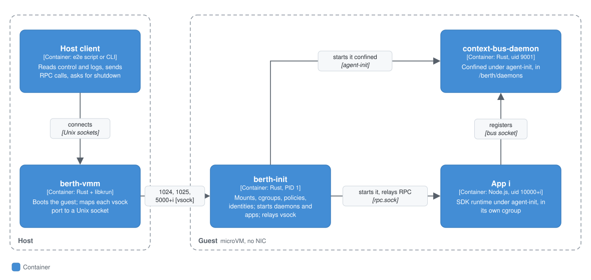

# berth-init: the microVM guest's PID 1

Date: 2026-10-01. Branch `feat/vm-guest-init`, stacked on `spike/libkrun-vm` (65fe6bf). Machine: Apple M4, macOS 27.0, HVF, libkrun 1.19.6, our 6.12.109 kernel from the spike.

> **Follow-up (2026-10-01, `feat/vm-runtime`):** current state in [`microvm-runtime.md`](microvm-runtime.md). berth-init now runs from feat/vm-image's erofs rootfs as PID 1 straight from the kernel, with the state disk at `/dev/vdb` and berth-vmm restoring its tail. The test rootfs (`build-guest-init-rootfs.sh`) and `e2e-guest-init.mjs` are replaced by `build-apps.sh` and `scripts/e2e.mjs`. Open problem 1 below is resolved there.

The spike booted apps/notes in a microVM with a shell script (`guest/berth-init.sh`) as its init and `socat` as the RPC relay, which started a new app process for every host connection. `berth-init` replaces both. It is one static binary (aarch64 musl, 645 KiB) at `/sbin/berth-init`, running as PID 1, and it does in the guest what `docker/entrypoint.sh` and tini do in the container:

1. **PID 1 duties.** It mounts proc, sys, dev (plus pts and shm), securityfs, cgroup2 and the tmpfs mounts. It reaps every zombie. It shuts down cleanly when the host asks, on SIGTERM/SIGINT/SIGPWR, or when no app is left running: it stops the apps, syncs, unmounts and powers off.
2. **The boot.** It compiles each app's policy, creates identities and directories, precreates declared paths, builds per-app cgroups, starts context-bus-daemon confined, and then starts each app under agent-init as its own uid, inside its own cgroup.
3. **A long-lived vsock relay.** One app process serves every host connection for the life of the VM. Logs and control have vsock ports of their own.

## Context

berth-init runs inside a Berth microVM. On the host, `berth-vmm` boots the guest with libkrun. In the guest, berth-init is PID 1 and starts everything else: context-bus-daemon, and each app under agent-init. The host reaches the guest only through vsock ports that berth-init listens on, for control, logs and each app's RPC. `scripts/e2e-guest-init.mjs` is the reference host side.

For where the microVM sits in Berth, see [`../local-vm.md`](../local-vm.md) and the [README](../../README.md#level-2-containers).

## Containers

<p align="center"></p>

On the host, a client talks to `berth-vmm`'s Unix sockets. In the guest, berth-init, context-bus-daemon and each app run as separate processes. The port plan says which vsock port carries what, and the relay section how an RPC connection reaches an app.

### vsock port plan

Every port is in **listen** mode (`berth-vmm --vsock PORT:SOCK:listen`): berth-init listens in the guest, and the host connects to the Unix socket libkrun creates. The guest never connects out, so no host-side listener exists today.

| Port | Name | Guest → host | Host → guest |
|---|---|---|---|
| 1024 | control | `{"source":"berth-init","event":"hello","protocol":1,...}`, then **every event since boot** (replayed to each new connection), then live events. Events: `boot_start`, `boot_phase`, `cgroup_delegation(_refused)`, `daemon_started`/`daemon_absent`/`daemon_exited`, `cgroup_limits_applied`/`_refused`, `app_started`/`app_ready`/`app_refused`/`app_exited`, `boot_complete`, `boot_failed`, `shutting_down`, `power_off` | `{"op":"status"}` → one `status` reply on that connection (each app's state, pid, uid, port, exit, and its cgroup path, the limits read back and `cgroup.procs`, plus `/berth/daemons`' procs). `{"op":"shutdown"}` → `shutting_down` … `power_off`, then the VM exits. Lines over 64 KiB close the connection |
| 1025 | logs | `{"t":<uptime ms>,"src":"<app>\|berth-init\|context-bus","stream":"stdout\|stderr\|init\|policy","line":"..."}`. The first line is always `log stream attached`, then a replay of up to 1 MiB of the most recent lines, then live lines. One reader at a time; a new connection replaces the old one. Every line also goes to the console (hvc0) | nothing (ignored) |
| 5000+i | RPC for app i | the SDK's line-JSON answers `{"id","result"}` / `{"id","error"}` / `{"id"}` (an export returning nothing) | `{"id","export","input"}` per line, any number of connections |

How the host knows the guest is listening: libkrun accepts the host's `connect()` on a listen-mode port **before** anything in the guest listens there, and closes it when the guest refuses. Control and logs therefore always send a greeting line first. A connection that closes before its greeting means "not yet", and the host reconnects (`connectGreeted` in the e2e script). On an RPC port, a call that gets a close before its answer is retried on a new connection.

#### The rule for the host side

**Guest root can open AF_VSOCK.** Apps cannot (agent-init's seccomp filter refuses it), but anything that becomes root in the guest can. It can bind a port before berth-init does, or speak on one berth-init is serving, so nothing that arrives from the guest is trusted because of the port it came in on. Every host-side reader of a guest port must therefore:

1. **Bound** every line (the e2e reader uses 1 MiB) and every buffer, and close the connection on overflow.
2. **Parse** each line as a JSON object, drop anything else, and check it for the shape that port carries before acting on it. A log line is data to display, never a command. An RPC answer is matched only to a request this host sent on *that* connection.
3. **Never let the guest pick the action.** The host decides what to call and when to stop. A `power_off` event is informational, and the VM is down when `berth-vmm` exits. A host that waits on an event must have a timeout.
4. **For any future host-side listener** (guest connects out: the egress dialer, a host-side state service): accept only the ports configured for that sandbox. Authenticate or scope each request against that sandbox's policy on the host, because the guest's identity claims (app names, uids) are only as good as guest root. Rate-limit them.

This is the spike's problem 7, written down. The same rule applies to the existing host listener libkrun creates for each port: a guest that floods a port only fills that port's own socket.

### The RPC relay

**Socket mode (default).** Each host connection on port 5000+i gets its own connection to `/run/berth/<app>/rpc.sock`, the per-app socket the SDK runtime already serves in multi-app Docker containers (`startRpcServer({ socketPath })`), and bytes are copied both ways. The SDK serves any number of connections concurrently. A host connection that arrives while the app is still booting waits up to 60 s for the socket, and gives up early if the app exits. The app's stdin is `/dev/null`, and its stdout and stderr go to the log port. That fixes the spike's problem 4: the local context-bus stub's `[context-bus:local]` lines can no longer appear in the middle of an RPC stream.

**Stdio mode** (`BERTH_VM_RPC=stdio`), as for a single-app Docker container. Host connections are multiplexed onto the app's one stdin/stdout. Each request's id is rewritten to a relay-unique `r<n>`, the original id and connection are remembered, and the answer goes back to that connection with its original id. A stdout line that is not an answer to a pending request is a log line. A request line over 32 MiB is answered with an error and the connection is closed.

Both modes are tested end to end. Socket mode is the one to use: it needs no id rewriting, and the RPC stream holds nothing but RPC.

## Components

Inside berth-init: the boot sequence, the per-app cgroup tree it builds, the shutdown path and the state disk.

### Boot sequence

Each step names the entrypoint.sh function it mirrors. Steps are timed in guest uptime, from the `boot_phase` events of a median run of `notes-plain` with `rcu_expedited`.

| Step | What berth-init does | entrypoint.sh | ms |
|---|---|---|---:|
| early mounts | proc, sys, devtmpfs, devpts (`newinstance,ptmxmode=0666,gid=5`), `/dev/shm`, securityfs, cgroup2 (`nsdelegate,favordynmods`), tmpfs `/run` and `/tmp`. Anything already mounted, for example by init.krun, is left alone | (tini + Docker) | kernel to `boot_start` ≈ 50 |
| control/log | listens on vsock 1024 and 1025 *before* the boot, so a failed boot is reported to the host | | |
| filesystems | hostname, `lo` up, tmpfs `/workspace` (or the state disk, below), tmpfs `/context`, the app shares (virtio-fs, read only) at `/app` (single) or `/app/<tag>` (multi, on a small tmpfs) | | 1 |
| cgroups | the tree below; berth-init moves itself into `/berth/daemons` first | `setup_app_cgroups` | 1 |
| policies | `node /opt/berth/sdk-node/generate-capability-policy.mjs` per app, **all apps in parallel**, as root, cwd = the app dir, environment cleared (so no `NODE_OPTIONS`/`NODE_PATH`), output to `/run/berth/policy/<tag>.json`. The app's name comes from the policy | `run_node_sdk_tool`, `precreate_declared_paths`' compile pass | 85 |
| identities | `berth-<app>` users (10000+index) and `berth-context-bus` (9001), group `berth` (9999), `tty` for `terminal:*` apps, merged into the image's passwd/group on tmpfs and bind-mounted over `/etc/passwd` and `/etc/group` (the root is read only). `/run/berth/<app>` 0711, `.../peers` 0711, `/tmp/<app>` 0700. `app:invoke:` grants as `peers/<caller>` 2710 | `provision_app_identity`, `grant_invoke_access` | 1 |
| declared paths | only the allowlisted prefixes `/workspace`, `/context`, `/tmp`, `/app` (canonical, no globs, no `node_modules`); one owner → `uid:uid 0755`, several → `root:berth 2775`; existing paths are left alone, except the tmpfs roots berth-init just mounted, which stand in for directories the image does not have | `precreate_declared_paths` | <1 |
| policy files | `root:<app gid> 0640` | `secure_capability_policy` | |
| context-bus-daemon | if `/usr/local/bin/context-bus-daemon` exists: under agent-init with the same daemon policy (write scope = the socket's directory, no network), uid 9001, groups 9001 and 9999; waits for its socket. Otherwise a `daemon_absent` event, and apps use the SDK's local bus | `start_context_bus_daemon` | 6 |
| apps | each app: write its cgroup limits, then fork; the child joins its cgroup (writes `0` to `cgroup.procs`), calls `setsid`, clears the signal mask, and execs `agent-init node <runtime>` with an explicit environment (below) | `place_app_in_cgroup`, `run_app` | 1 |
| app ready | agent-init (Landlock, seccomp, caps, uid drop), then the SDK runtime loads the app, connects to the bus and binds `rpc.sock`. berth-init watches stderr for `"<app>" ready` and emits `app_ready` | | ≈ 175 |

The app's environment is built from nothing: PATH, `HOME`/`TMPDIR`/`TMUX_TMPDIR`/`XDG_*` under `/tmp/<app>` (`export_app_environment`), `BERTH_BOOT_ID`, `BERTH_APP_NAME`, `BERTH_APP_UID/GID/SUPPLEMENTARY_GIDS`, `BERTH_CAPABILITY_POLICY`, `BERTH_MANIFEST_PATH`, `BERTH_REQUIRE_ENFORCEMENT`, `BERTH_WORKSPACE_ROOT=/workspace`, `BERTH_CONTEXT_BUS_SOCKET`, `BERTH_SHARED_GID`, `BERTH_NO_SEMANTIC_FS=1`, `BERTH_RPC_SOCKET` (socket mode), `BERTH_APP_ENTRY` (when `dist/index.mjs` exists), and `NODE_ENV` if the host set it. Nothing from PID 1's own environment, which comes from the kernel command line, reaches an app.

### Per-app cgroups

```
/sys/fs/cgroup                    the guest's own root (cpu memory pids enabled)
└── berth/
    ├── daemons/                  berth-init (the relay), context-bus-daemon,
    │                             the policy compiles; cpu.weight 1000
    └── apps/                     memory.max = MemTotal - 256 MiB
        ├── notes/                cpu.max 50000 100000, cpu.weight 100,
        │                         memory.max 167772160, memory.swap.max 0, pids.max 256
        └── filesystem/           cpu.max 100000 100000, ..., memory.max 201326592
```

The semantics are feat/per-app-cgroups' (`packages/manifest-schema/src/resources.ts` and its entrypoint.sh):

- The limits are the policy's `cgroupLimits`, written by the compiler from `resources:`. When a policy has none, the app gets the defaults every app gets, `cpu.weight 100` and `pids.max 1024`.
- berth-init writes only `cpu.max`, `cpu.weight`, `memory.max`, `memory.swap.max` and `pids.max`, and only values matching `^[0-9a-z ]+$`. A policy listing `memory.high`, `cgroup.procs` or `cgroup.subtree_control` gets them skipped and logged. **There is no `memory.high`.**
- The daemon reserve works by subtraction for memory and by weight for CPU (1000 against the apps' 100). A guest too small to hold the reserve plus 32 MiB keeps no reserve.
- A missing `memory.swap.max` is tolerated only when `SwapTotal` is 0. Our guest kernel has swap accounting, so the file exists and is written.
- Under strict mode, any other limit that did not apply refuses that app (`cgroup_limits_refused`). The rest of the sandbox still boots.
- What applied is read back from the kernel, logged, and emitted as `cgroup_limits_applied`, the same event entrypoint.sh emits, so `berth attest` can read either.

The app joins its cgroup **between fork and exec**, so agent-init and everything the app starts are inside it from the first instruction. Its files belong to root, the app has no capabilities after agent-init, and no policy can grant it a Landlock write on `/sys`.

**favordynmods.** Each cgroup migration was waiting for an RCU grace period (`cgroup_threadgroup_rwsem`), about 20 to 30 ms each on this guest: once for berth-init and once per app. cgroup2 is now mounted with `favordynmods`, which pays that cost once at mount instead. The mount is retried without the option on a kernel that lacks it. `rcupdate.rcu_expedited=1` on the kernel command line shortens the remaining grace periods, for example the one at mount. It is the cheapest boot win found (about 60 ms; see Measurements) and is a cmdline choice for whoever owns the cmdline (feat/vm-image).

### Shutdown

On a control `shutdown`, a signal, or no app left running, berth-init:

1. emits `shutting_down`;
2. sends SIGTERM to each app's and daemon's session (each leads its own after `setsid`), waits up to the grace period while reaping, and then sends `kill(-1, SIGKILL)`;
3. syncs, unmounts every mount point children-first (from mountinfo, reversed) except `/proc`, `/sys` and `/dev`, falls back to a lazy detach when a mount is busy, remounts `/` read-only and syncs again;
4. emits `power_off` with the reason, exit code (0 only if every app exited 0 or was stopped on request), each app's final state, what had to be SIGKILLed, and any unmount failures;
5. calls `reboot(RB_POWER_OFF)`, which ends the VM: libkrun exits with 0.

Ctrl-Alt-Del is turned into a SIGINT, which is handled like SIGTERM. A Rust panic powers off after printing why (`panic = "abort"`, with a hook) rather than ending in a kernel panic.

### State disk (feat/vm-image compatibility)

If `BERTH_STATE_DEV=/dev/vdX` is set (feat/vm-image's `berth-vmm --state` sets it), berth-init checks for the ext4 magic at byte 1080. If the disk is blank it runs `mkfs.ext4 -q -L berth-state -m 0 -E root_owner=0:0,nodiscard`, then mounts the disk on `/state` (nosuid, nodev) and bind-mounts `/state/workspace` onto `/workspace`. The precreate pass then sets `/workspace`'s ownership as usual, on every boot. The `state` e2e mode boots twice on one disk image, and a note added in the first boot is listed in the second.

libkrun 1.19.6 truncates the image by 64 KiB when mkfs zeroes the last blocks. feat/vm-image's berth-vmm restores the size before boot (b5cecef); this branch's berth-vmm does not have that yet, so the test restores the size itself.

## Code

Code: `packages/vmm/init/` (crate `berth-init`, dependencies `libc` and `serde_json` only).

### Configuration

libkrun passes `berth-vmm --env K=V` to PID 1 on the kernel command line, so the configuration is a handful of short variables. JSON would need quoting that the command line does not survive.

| Variable | Default | Meaning |
|---|---|---|
| `BERTH_VM_APPS` | `app` | virtio-fs share tags, comma separated, in the host's order. The order fixes each app's uid (10000+i) and RPC port (5000+i). Tags are `[a-z0-9-]{1,32}`, at most 64 |
| `BERTH_VM_RPC` | `socket` | `socket` or `stdio` (see the relay section) |
| `BERTH_REQUIRE_ENFORCEMENT` | `1` | passed to agent-init and to the confined daemon |
| `BERTH_REQUIRE_APP_CGROUPS` | `1` | refuse the boot without cgroups, and refuse an app whose limits did not all apply |
| `BERTH_DISABLE_APP_CGROUPS` | `0` | no per-app cgroups at all |
| `BERTH_DAEMON_MEMORY_RESERVE_MB` | `256` | held back from `/berth/apps` |
| `BERTH_DISABLE_DAEMON_CONFINEMENT` | `0` | context-bus-daemon as root, unconfined (the negative control) |
| `BERTH_VM_STOP_GRACE_MS` | `3000` | SIGTERM to SIGKILL at shutdown |
| `BERTH_STATE_DEV` | unset | feat/vm-image's state disk, below |
| `BERTH_CONTEXT_BUS_SOCKET` | `/tmp/berth-context-bus.sock` | as in the image |

`BERTH_REQUIRE_APP_CGROUPS` defaults to **on** in the VM. In Docker it is off by default because a host without nsdelegate cannot give the sandbox a safe writable cgroup namespace. In the VM berth-init owns the cgroup root, so no host configuration can excuse missing cgroups.

### How to build and run

Nothing is installed on the host. The only Rust toolchain is Alpine's, inside a builder VM.

```sh
cd packages/vmm
./scripts/build-berth-init.sh        # builder VM: cargo test, static berth-init + context-bus-daemon (~90 s cold, ~40 s warm)
./scripts/build-guest-init-rootfs.sh # test rootfs (APFS clone of the spike's) + app dirs
node scripts/e2e-guest-init.mjs single     # 11 checks
node scripts/e2e-guest-init.mjs multi      # 13 checks: notes + filesystem
node scripts/e2e-guest-init.mjs stdio      # single in stdio relay mode
node scripts/e2e-guest-init.mjs exits      # last app exits; refused boot
node scripts/e2e-guest-init.mjs state      # /workspace on a state disk across two boots
INIT_KRUN=1 node scripts/e2e-guest-init.mjs single   # exec'd by libkrun's init.krun
RUNS=6 BENCH_APP=notes-plain CMDLINE_EXTRA=rcupdate.rcu_expedited=1 node scripts/e2e-guest-init.mjs bench
```

Artifacts go to `/Users/ash/berth-wt/vm-guest-init-artifacts` (`GI_ART`). The spike's `libkrun-vm-artifacts` are only read: the kernel `Image`, plus `cp -c` clones of its builder root and `rootfs-notes`. The test rootfs adds berth-init at `/sbin/berth-init` (with the spike's shell init kept at `/sbin/berth-init.sh` for probe mode), context-bus-daemon, `e2fsprogs`, `/context` and `/state`. It also adds the policy compiler bundled from **`feat/per-app-cgroups`** (`POLICY_REF`), because that branch's compiler is the one that writes `cgroupLimits`. The app dirs are notes and filesystem, bundled from this tree, with `context_bus.proto` and a test `resources:` block appended to the copied `berth.yml` (`TEST_RESOURCES=1`; the repo's `apps/` are untouched). `notes-plain` has no resources block and is what the benchmark boots.

## Results

| Goal | Result | Evidence |
|---|---|---|
| 1. PID 1: mounts, reaping, clean shutdown | **Pass** | Boots as `init=/sbin/berth-init` with no init.krun, and also exec'd by init.krun (`INIT_KRUN=1`). Shutdown on request takes 37–48 ms from the host's `{"op":"shutdown"}` to `berth-vmm` exiting 0, with `unmountFailed: []`. When the last app exits, the VM powers itself off with `exitCode 1` (`exits` mode). A refused boot is reported on the control port, then the VM powers off |
| 2. Boot sequence, single and multi-app | **Pass** | Policy compiled by the image's node bundle as root, with an explicit environment. Declared paths are precreated with entrypoint.sh's ownership rules: `/workspace` goes to uid 10000 alone, or to `root:berth 2775` when notes and filesystem share it, and `/context` goes to filesystem's uid. Per-app cgroups are built from `cgroupLimits`. context-bus-daemon runs confined (uid 9001, `FullyEnforced`). Each app runs under agent-init as 10000+index |
| 3. Long-lived RPC relay, logs separate | **Pass** | 7 calls over one connection plus a second concurrent connection reach the **same pid** (227 → 227). Zero non-RPC lines on either RPC stream. The app's stdout/stderr arrive on the log port. Socket mode (default) and stdio mode both pass |
| 4. vsock port plan, host validation rule | **Done** | Below. `scripts/e2e-guest-init.mjs` is the reference host side |
| 5. Tests | **Pass** | 19 unit tests in the builder VM. End-to-end: single 11/11, multi 13/13, stdio 11/11, exits 4/4, state disk 4/4, single via init.krun 11/11 |
| 5. Boot time against the spike's 0.39 s | **Faster on a like-for-like run** | Same host, same load, interleaved: spike 555 ms, berth-init 489 ms, and 426 ms with `rcupdate.rcu_expedited=1` (pooled medians, n=15 each). The host was busy (load 6 to 9) throughout, so the absolute numbers are higher than the spike's quiet-host 393 ms. See Measurements |
| 6. This document | Done | |

## Measurements

t=0 is `spawn(berth-vmm)` on the host. The figure is when the first `add_note` answer arrives on the host: 2 vCPU, 512 MiB, read-only virtio-fs root, a new VM and a new policy compile each time. The host was **not quiet**: another agent was building images, and load averages were 6 to 9 throughout. So the configurations were run **interleaved**, three rounds of first + 5 boots each, against the spike's own `boot-notes.mjs` on a clone of its rootfs:

| Configuration | Round medians (ms) | Pooled median of the 15 repeats |
|---|---|---:|
| spike: init.krun + `berth-init.sh` + socat, no context-bus, no cgroups | 566, 494, 607 | **555** |
| berth-init, notes without `resources:` (cgroup defaults), context-bus-daemon on | 489, 556, 429 | **489** |
| same, `rcupdate.rcu_expedited=1` | 403, 490, 426 | **426** |
| berth-init, notes **with** `cpu: 0.5` etc., context-bus-daemon on, `rcu_expedited` | 578, 600, 684 | 593 |

The least-loaded round earlier in the day gave spike 463, berth-init 408, and `rcu_expedited` **378** (repeats 368 to 399). So on this hardware berth-init boots to first RPC in about 0.77× the spike's time under the same conditions. That is despite the boot doing more than the spike's: a confined context-bus-daemon, which the runtime then connects to; cgroup setup; identities. The quiet-host spike figure of 393 ms could not be re-measured while the other build was running.

Where the time goes, from guest uptime marks on a `rcu_expedited` notes-plain boot:

| Phase | ms |
|---|---:|
| host spawn → kernel → berth-init's first event | ≈ 50 (guest) + VMM setup |
| mounts + cgroups | 1–2 |
| policy compile (node + 1 MB bundle) | 85–95 |
| identities, paths, context-bus-daemon start (socket up in 5–10 ms) | 7 |
| agent-init + runtime + app load + bus connect → `ready` | 170–190 |
| ready → answer on the host | 20–30 |

The CPU-limited configuration is slower because `cpu.max 50000 100000` (half a CPU) applies from the app's first instruction, which includes node's own startup. That is the limit doing its job, but for `berth dev` a startup burst allowance would help (open problem 4).

Shutdown, from the host's request to `berth-vmm` exiting: 36 to 48 ms.

## Open problems

1. **Merging with feat/vm-image.** Their image bakes `berth-app<i>` (10000+i), `berth-context-bus` and `berth` into `/etc/passwd`. berth-init replaces any entry holding one of its uids with `berth-<appname>` via a bind mount over `/etc/passwd` and `/etc/group`, which context-bus-daemon needs in order to name a peer. Either keep that, or drop the baked slots. The image must provide the mount points `/app`, `/workspace`, `/context`, `/state`, `/run`, `/tmp`, plus `/usr/local/bin/agent-init`, `/usr/bin/node`, `/opt/berth/sdk-node/generate-capability-policy.mjs` (built from a tree that has feat/per-app-cgroups' `cgroupLimits`), `/sbin/mkfs.ext4` (only with a state disk), and optionally `/usr/local/bin/context-bus-daemon`. `socat` can leave the package list. Their `berth-init.sh` stop port (vsock 5001) clashes with this plan's RPC port for app 1. Use control `{"op":"shutdown"}` on 1024 instead, and keep 5000+i for RPC. Their kernel cmdline should add `rcupdate.rcu_expedited=1`. Their boot uses init.krun with `krun_set_root_disk_remount`; berth-init is tested both directly as `init=` and exec'd by init.krun over virtio-fs, but not yet over their erofs root. It acts as child subreaper if init.krun ever forks it rather than execs it.
2. **Python apps.** `/etc/berth/runtime/<app>` = python (`run_python_sdk_tool`, `python3 -m berth_sdk.runtime`) is not implemented. Every app is started as node.
3. **Not ported from entrypoint.sh:** run-lifecycle flags (browser display stack, egress and GitHub brokers, mesh), the governance gate wiring (`grant_governor_access`, `BERTH_GOVERNANCE_*`), per-app secrets (`BERTH_APP_SECRETS_DIR`), and the dev-workspace chgrp. semantic-fs is ported (feat/vm-semantic-fs-init, [`microvm-semantic-fs.md`](microvm-semantic-fs.md)): berth-init starts the daemon as root before any app, `/context` is its FUSE mount, and apps get `BERTH_SEMANTIC_FS_SOCKET`; `BERTH_NO_SEMANTIC_FS=1` is set only in an image without the daemon. The egress broker in particular needs the host-side dialer behind its own vsock port, under the listener rule above.
4. **CPU limits and startup.** With `cpu.max` set, node's own startup runs throttled. Options: apply `cpu.max` after `app_ready`, or allow a burst with `cpu.max.burst`. That is a semantics change to agree with feat/per-app-cgroups, so it is not made here.
5. **Log backpressure.** A slow log reader on the host can stall an app's stderr for up to the 2 s send timeout per line before it is dropped. A per-reader queue would decouple the two.
6. **Stdio mode** does not route `stdout` log lines that happen to parse as an answer to a pending id. That is only a risk if an app prints JSON with ids like `r<n>`; socket mode has no such ambiguity.
7. **Boot readiness** is detected from the runtime's `"<app>" ready` stderr line. An explicit readiness signal from the SDK would be sturdier.
8. **The guest-root vsock exposure** is unchanged: the rule above is what makes it safe, and it holds only if every future host listener follows it.
