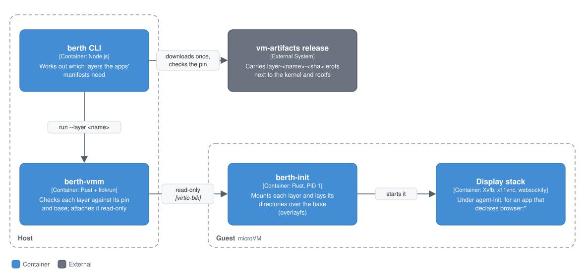

# Optional layers for the microVM, and embeddings

Status: layers and the browser layer built (feat/vm-layers); embeddings still a proposal. Covers the browser (the last capability the VM refused) and a proposal for embeddings.

## Context

A layer adds large, optional software, such as the browser, to a microVM sandbox without putting it in every user's rootfs download. It involves the CLI, which works out from the apps' manifests which layers a sandbox needs, the vm-artifacts release that carries them, and `berth-vmm` and `berth-init`, which attach and mount them.

### The problem

Everything a VM sandbox can run is in one rootfs image, and every user downloads all of it on `berth vm install`. That stopped being a good trade at the browser:

| | uncompressed | in the rootfs (erofs, lz4hc) |
|---|---|---|
| Base rootfs on main (node, python3, the daemons) | 147 MB | 79.5 MB |
| tmux and ttyd (feat/vm-terminal, feat/vm-ttyd) | +3 MB | +1.6 MB |
| Embeddings kit (feat/vm-embeddings) | +34 MB | +28 MB |
| Browser: Chromium, Xvfb, x11vnc, noVNC, dbus, fonts | +838 MB (measured in a builder: 73 MB to 910 MB; Chromium alone 288 MB) | an estimated +350 to 450 MB |

Most sandboxes never start a browser. Putting it in the rootfs would make every user's first download several times bigger and would put a 400 MB image behind every rootfs pin bump.

## Containers

<p align="center"></p>

Building, Shipping and Booting follow a layer from the build to a running sandbox: the release carries it, the CLI fetches it, and berth-vmm and berth-init attach and mount it.

### Design: layers, downloaded when an app needs one

A **layer** is a content-addressed, read-only erofs image of files to add to the base rootfs, built and pinned like the rootfs itself, and attached only to a sandbox whose apps need it.

#### Building

- `scripts/build-layer.sh <name>` runs in the same pinned Alpine builder as `build-rootfs.sh`. It unpacks the base rootfs tree, installs the layer's packages (`rootfs/layers/<name>/packages.txt`, locked in `<name>.apk.lock`) with `apk --root`, and keeps only the files that are new or changed relative to the base. That delta becomes `layer-<name>-<sha256>.erofs`, using the same fixed timestamp and UUID as the rootfs.
- A layer is built against one base rootfs, because its libraries link against the base's. The pins in `rootfs/manifest.toml` say so:

  ```toml
  [layers.browser]
  image_sha256 = "..."
  image_size = ...
  base_rootfs_sha256 = "..."   # must equal image_sha256 above it
  ```

  This means a rootfs bump rebuilds every layer. CI does it in the same `vm-artifacts` run, and checks each layer against its pin, as it does the rootfs.
- `berth-vmm` compiles the manifest in, so it boots only a pinned layer built for the rootfs it's booting.

#### Shipping

- The release carries the layers as extra assets: `layer-browser-<sha>.erofs`. `berth vm install` doesn't fetch them.
- `berth dev`, `berth mcp`, `Computer.boot()` and the other boot paths work out what the sandbox needs from its apps' manifests. A `browser:` capability other than `navigate`, for example, needs the browser layer. A layer that isn't installed yet is downloaded then, from the same release, checked against its pin as it streams and before it's renamed into place (the `installArtifacts` path). It says so first, with the size: `the browser layer (412 MB) is needed by browser-native; downloading once...`.
- `berth vm install --layer browser` fetches one ahead of time, for CI and for offline use.

#### Booting

- `berth-vmm run --layer <name>` attaches the image as another read-only virtio-blk disk, after rootfs, state and secrets. It hashes the image like the rootfs, and the measurement line gains `layers: [{ name, sha256, pinned }]`, which `berth attest` records under `boot.isolation`.
- `berth-init` mounts each layer at `/layers/<name>`. For each top-level directory the layer has, such as `/usr` and `/etc/fonts`, it puts an overlay over the base: `lowerdir=/layers/<name>/usr:/usr`. This happens before it binds `/etc/passwd` and `/etc/group`. Nothing writable is involved: the overlay has two read-only lowers and no upper.
- An app's Landlock baseline already covers `/usr` and `/etc`, so Chromium's files are readable without new policy.

## Components

What goes into the browser layer, what else layers could carry, and the options for embeddings.

### The browser layer

- Packages: `chromium` (`chromium-chromedriver` isn't needed), `xvfb`, `x11vnc`, `websockify`, `novnc`, `dbus`, `ttf-freefont`, matching the container's `base.Dockerfile`.
- `playwright-core` goes in the layer too, as `node_modules`, the way the embeddings kit carries transformers. It reads its own package files at run time and doesn't survive bundling into an app. The CLI marks it external for VM bundles.
- `berth-init` starts the display stack for a `browser:` app: Xvfb, x11vnc and websockify, confined like the other daemons. This is the part of `entrypoint.sh`'s run-lifecycle flags not yet ported.
- noVNC's port is published with the `--publish` built for ttyd (feat/vm-ttyd), and `berth dev` prints its loopback URL and the VNC password, as it does for a container.
- Chromium's traffic goes through the egress broker, which already runs in the guest for `browser:navigate:` scopes.
- RAM: Chromium and Xvfb want at least 1 GiB on top of the app. The CLI gives a sandbox with a browser app 2048 MiB.
- Tests: an e2e `browser` mode boots `apps/browser-native` with the layer, then checks `navigate`, `get_page_text` and `click` against example.com through the egress broker, and that `169.254.169.254` and `file://` another app's directory are refused, as the LangChain e2e checks a container. A CLI check covers the download prompt and the noVNC URL.

### What else layers are for

The same mechanism fits anything large and optional. In order of size:
- the browser;
- Python packages beyond `berth_sdk`'s dependencies, if apps ever get a pip step;
- the embeddings kit (below).

### Embeddings: what's built, and a proposal

**What feat/vm-embeddings does.** The rootfs carries the kit: transformers bundled, onnxruntime's WASM and all-MiniLM-L6-v2, 28 MB compressed. One embeddings daemon per sandbox loads the model on the first query, so an app that never queries `/context` pays nothing. Loaded, it takes about 250 MB of RAM (measured: node at 38 MB, 245 MB with the model, 265 MB peak), so a single-app sandbox that declares `/context` gets 768 MiB instead of 512. It works (a query sharing no word with a tag finds the file by meaning), but 250 MB per sandbox is a lot for ranking a few hundred short tags.

The options for where embeddings come from:

| | Guest RAM | Download | Same vectors as Docker | Cost |
|---|---|---|---|---|
| A. Kit in the rootfs, one daemon per sandbox (built) | about 250 MB when used | +28 MB for everyone | yes | the RAM, and 768 MiB sandboxes |
| B. A, with the kit as a layer | the same | +28 MB only for `/context` apps | yes | layer plumbing; saves little |
| C. Embeddings on the host: the CLI computes them, the guest asks over a vsock port | none | none | yes | a new guest-to-host channel carrying app text into a host Node process; needs the CLI process alive, which a detached VM can outlive |
| D. A static embedding model (for example model2vec's potion-base-8M: a token-vector lookup and a mean, no transformer, no WASM) | about 10 to 30 MB, in-process | about 8 to 30 MB | no: a different model, so a different vector space | quality to measure; a one-time re-embed for Docker too |

**Recommendation: D, for both runtimes, after a spike that proves the quality.** A static model makes the daemon unnecessary: each app embeds in-process at a few MB, loads in milliseconds rather than half a second, and needs no WASM, so the memory bump and the 28 MB kit go away. The index already stores the model name next to each vector (`files_vec.model`, and cosine is compared only within one model), so a switch is safe. Old vectors simply stop counting until they're re-tagged, and a one-shot re-embed in semantic-fs's control socket can be added for that. Changing both runtimes at once keeps a snapshot's vectors meaningful wherever it's restored.

The spike, before anything changes:
1. Run `semantic-fs-milestone.mjs`'s queries (and the e2e's "authentication credentials timing out" against "login token expiry bug" / "quarterly marketing plan") through all-MiniLM-L6-v2 and through two static models.
2. Compare the rank of the right file, the margin over the wrong one, and the 0.2 cosine threshold, since static vectors score differently.
3. Measure RSS and load time in the guest.

If a static model ranks those cases as well, switch. If not, keep A as built and do B once layers exist. C is the option I'd rule out: a host process doing work for the guest on app-supplied text is the kind of channel the VM is there to avoid.

## Code

- **Build:** [`packages/vmm/scripts/build-layer.sh`](../../packages/vmm/scripts/build-layer.sh) `<name>`. Each layer's package list, lock and staged files are in [`packages/vmm/rootfs/layers/<name>/`](../../packages/vmm/rootfs/layers) (`packages.txt`, `apk.lock`, `stage-files.sh` for the browser).
- **Pins:** [`packages/vmm/rootfs/manifest.toml`](../../packages/vmm/rootfs/manifest.toml), as `layer_<name>_sha256`, `layer_<name>_size` and `layer_<name>_base`.
- **Boot:** `berth-vmm run --layer <name>` (repeatable) attaches `<artifacts>/layers/layer-<name>-<sha>.erofs` read-only ([`packages/vmm/src/run.rs`](../../packages/vmm/src/run.rs)). berth-init mounts each layer under `/run/layers/<name>` and builds the overlays in `layer_overlays` ([`packages/vmm/init/src/plan.rs`](../../packages/vmm/init/src/plan.rs)).
- **CLI:** `layersFor()` in [`packages/cli/src/vm/support.ts`](../../packages/cli/src/vm/support.ts) picks the layers, `ensureLayers()` in [`packages/cli/src/vm/runtime.ts`](../../packages/cli/src/vm/runtime.ts) downloads a missing one, and `berth vm install --layer browser` fetches one ahead of time.

## Steps

1. **Layers.** The build script, the pins, `berth-vmm --layer`, `berth-init`'s overlay mounts, CLI download on demand, attestation of layers. Proven with a small test layer (a few KB, holding a marker binary) before the browser.
2. **The browser layer.** The packages, playwright-core, `berth-init`'s display stack, `--publish` for noVNC, 2048 MiB, and the e2e `browser` mode.
3. **Embeddings.** The spike above, then D or B.

## What building it found

- **The browser layer is 478.5 MB** (456 MiB, 5,789 paths), above the 350–450 estimate. The example layer (figlet) is 460 KB.
- **A layer depends only on its packages and staged files.** The same layer image came out on three different bases as `berth-init` changed. The base pin still binds it to one rootfs, which costs a rebuild in CI and changes nothing else.
- **Making it reproducible took two fixes,** found by extracting two builds and diffing them. Fontconfig's caches record when they were built, so `/var/cache` is dropped from a layer; the programs that use those caches rebuild them at run time. And dbus's install script writes a random `/etc/machine-id`, which is removed when the base has none.
- **Packages bring setuid helpers** (Chromium's `chrome-sandbox`, dbus's launch helper). The build strips the bits and lists the files in `layer-<name>-<sha>.setuid-stripped.txt`. Nothing in a sandbox could use them: apps run with `no_new_privs`, and Chromium with `--no-sandbox`.
- **Xvfb writes its compiled keymaps under `/tmp`,** so the display daemon's policy may write `/tmp`. Apps' own `/tmp/<app>` directories are 0700 and theirs.
- **Overlayfs over `/usr` and Landlock get along:** the apps' baseline rules on `/usr` cover the layer's files, and nothing under the overlay is writable (`EROFS`).
- **Chromium runs under the VM's seccomp filter and `no_new_privs` with `--no-sandbox`,** as in a container. The test boots browser-native, loads example.com through the egress broker and the host dialer, and gets the broker's refusal for the metadata address.
- **Resumable downloads** came first, in #256: a stalled download is retried and resumed with a Range request.

## Open questions

- **Every rootfs bump rebuilds every layer in CI** (about 10 minutes for the browser), only to move its base pin. The image itself doesn't change, and since its file is named by its own hash, an installed layer is reused, not downloaded again. Pinning a layer to the base's package set, rather than to the base image's hash, would save the rebuild; it needs a hash of the base's apk database in the manifest.
- **Only one layer, the browser, is published for apps.** The example layer ships too, so CI and the e2e can prove the mechanism; it is 460 KB.
- **The display stack runs whenever the browser layer is attached,** even for a sandbox that only drives Chromium headless (`BERTH_TEST_MODE`). Starting it lazily, on the app's first display connection, would save about 40 MB.
