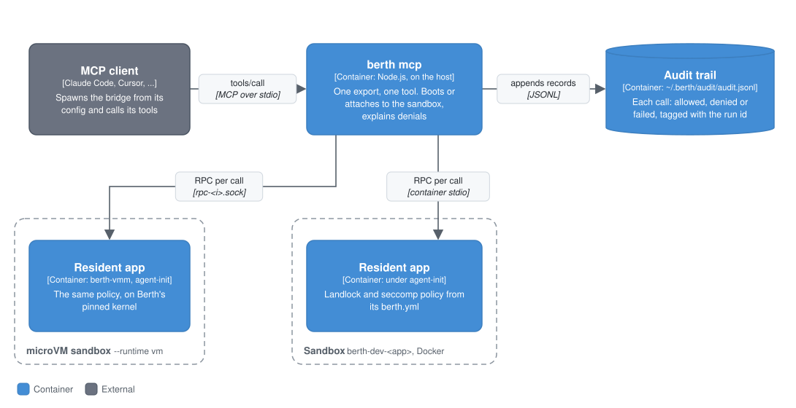

# MCP bridge reference

`berth mcp --app=<name>` serves one resident app's `berth.yml` exports as [MCP](https://modelcontextprotocol.io) tools over stdio, so an MCP client such as Claude Code, Claude Desktop or Cursor can call them. For client setup and the warm-up step, see [the MCP quickstart](./mcp-quickstart.md).

This page covers Berth as an MCP *server*. For a Berth agent that uses an external MCP server's tools, see `createMcpClientTools()` in the [agents reference](./agents-reference.md#consuming-an-external-mcp-server-createmcpclienttools).

## Context

An MCP client on your machine starts `berth mcp` and calls the tools it lists. Each tool is one export of a resident app, running in a sandbox whose kernel-enforced policy comes from the same `berth.yml`. The bridge records every call in the [audit trail](./audit-reference.md), so [`berth attest`](./attestation-reference.md) can report the session afterwards. For how this sits among the rest of Berth, see the [README](../README.md#plug-in-the-agent-you-already-have).

## Containers

<p align="center"> Docker sandbox, or over the run directory's rpc-<i>.sock in a microVM sandbox." width="100%"></p>

### How it works

- **It boots the sandbox itself, in the background.** If no container named `berth-dev-<app>` is running, the bridge builds and boots one the same way `berth dev` does. It answers `initialize` and lists the tools straight away, since both come from `berth.yml`; tool calls wait for the boot, for up to `--boot-timeout`, and stop waiting when the client cancels them. A first build takes minutes, longer than a client waits for `initialize`. If the boot fails at any step, each tool call returns the reason, and whatever it had started (the container, its `-fs` sidecar) is removed. Two sessions started at once for the same app don't both boot it: one does, and the other waits for its container and attaches to it (booting its own only if the first boot fails). An MCP client spawns one command, so the bridge can't rely on you running `berth dev` first.
- **It cleans up what it started.** A container the bridge booted is stopped when the bridge exits, on SIGINT, SIGTERM or SIGHUP, when the client closes stdin, or when a write to stdout fails because the client closed its pipes, including one still booting: it is stopped by name, with its sidecar, without waiting for the boot. On closed stdin the bridge first lets the boot evidence record finish; a signal stops the sandbox straight away, since clients follow SIGTERM with SIGKILL within seconds. A SIGKILL can't be handled, so a bridge killed outright still leaves its sandbox running. A container that was already running is left alone.
- **Each export becomes one tool.** The export's `input` fields in `berth.yml` become the tool's input schema, one field to one field. Nothing is inferred beyond what the manifest declares.
- **Calls go straight to the app.** Each tool call is a request/response RPC over the container's stdio, on one connection held for the life of the bridge.
- **Every call is audited.** Each tool call is written to the [audit trail](./audit-reference.md) as allowed, denied (the sandbox refused it) or failed (the app errored, or never answered, in which case the record says the call may have run), tagged with the session's run id. Calls still in flight when the session ends are recorded as interrupted. Once connected, the bridge also records the sandbox's boot evidence. That makes the session something [`berth attest`](./attestation-reference.md) can attest, even after the bridge has stopped the sandbox. Inputs and outputs aren't written.
- **Stdout is the MCP transport.** Every human-readable line, including build progress and the container's enforcement status, goes to stderr.

With `--runtime vm` the bridge talks to the app over the microVM's `rpc-<i>.sock` in its run directory instead of the container's stdio ([local microVM runtime](local-vm.md); [`packages/cli/src/vm/sandbox.ts`](../packages/cli/src/vm/sandbox.ts)).

## Components

Inside the bridge: the tool list, built from the manifest's exports, and the audit recorder, both under [How it works](#how-it-works); and the denial explainer, which every tool call's error passes through, below.

### Denials as the API

A tool call's error goes through the denial explainer before it's returned to the client as `isError` content. A permission error (`EACCES`, `EPERM`, `EROFS`) comes back as a labelled block: what was denied (the syscall and path), what denied it, the capability line that would allow it and where it goes, and the app's current declarations. [The quickstart](./mcp-quickstart.md#what-a-denial-looks-like) shows the full output.

The rules it follows:

- **A fix is offered only when one exists.** A `filesystem:` scope may only name `/workspace`, `/context`, `/tmp` or `/app`, so a denial at `/etc` gets `fix: none available`. For a grantable path it prints the exact line, and notes that the app must restart because a Landlock ruleset can't be widened on a running process.
- **`denied-by:` follows the container's own report.** At startup the bridge reads the enforcement status `agent-init` logged when the container booted. It says `the kernel` only for a fully enforced ruleset, flags a partially enforced one, says outright that a denial on an unenforced container is not the Landlock policy, and says `unknown` when it couldn't read the status. [`berth doctor`](./doctor-reference.md) gives the same answer for the whole host.
- **Other failures aren't dressed up as capability failures.** `EROFS` is the read-only workspace mount, and the message points at the app's data directory instead. A path the app already declares that still fails points at file ownership. `ENOENT`, input validation errors and ordinary app errors pass through unchanged.
- **An ambiguous syscall stays ambiguous.** `open(2)` is used for reads and writes, so the message offers both lines and asks you to declare the one the export needs.
- **Network denials** name the `network:connect:<port>` line to add, and point at `network:host:<pattern>` and the egress broker for hostname scoping.
- **Possible refusals inside a call that succeeded** are passed on only for an export whose `berth.yml` output declares `denials` (code-interpreter's `run_code`: code that caught a `Permission denied` and carried on). They come after the result as a `POSSIBLE SANDBOX REFUSAL (reported by <app>)` note, never under the bridge's own `BERTH CAPABILITY DENIAL` heading: the app read them out of its output, and the bridge didn't see them happen. The audit record stays `allowed` and carries only how many were reported and their paths (`meta.reportedDenials`, `meta.reportedDeniedPaths`), not the output lines. Any other app's `denials` field is left as plain data.

## Code

### Usage

```bash
berth mcp --app filesystem --app-dir apps/filesystem
berth mcp --app filesystem --app-dir apps/filesystem --only write_file,read_file
berth mcp --app filesystem --app-dir apps/filesystem --no-boot
berth mcp --app filesystem --app-dir apps/filesystem --warm
berth mcp --app filesystem --app-dir apps/filesystem --run-id nightly-2026-09-28
```

| Flag | Default | What it does |
|---|---|---|
| `--app=<name>` | required | The app's name, as declared in its `berth.yml`. A mismatch with the manifest's name prints a warning and uses `--app` |
| `--app-dir=<path>` | `.` | The app's directory, where `berth.yml` lives |
| `--container=<name>` | `berth-dev-<app>` | The container (or microVM sandbox) to attach to or boot |
| `--runtime=<docker\|vm>` | `docker` | Where the sandbox runs. `vm` is the [local microVM runtime](local-vm.md): the bridge attaches to a running `berth dev --runtime vm` sandbox or boots its own. Defaults to `BERTH_SANDBOX`, then `"sandbox"` in `~/.berth/config.json` |
| `--only=<a>,<b>` | every export | Bridge only these exports. A name not in the manifest is an error |
| `--env=<NAME>` / `--env=<NAME=value>` | none | A variable for the sandbox this command boots: `NAME` takes the value from this shell's environment (so it stays out of shell history, `ps` and the MCP client's config), `NAME=value` is visible in both. Repeatable. A name the app declares under `secrets:` reaches that app alone. With `--runtime vm` it travels on the secrets disk, never the kernel command line. A sandbox the bridge attaches to keeps the variables it was started with, and the bridge says so on stderr. See [secrets](secrets-reference.md) |
| `--env-file=<path>` | none | A dotenv file of variables, applied before `--env` |
| `--no-boot` | boots | Attach to a running container only; fail if there isn't one |
| `--warm` | off | Build the image, boot the sandbox, wait for the app to report ready, stop it, exit 0. Doesn't serve MCP. Makes the first tool call of the next session fast |
| `--boot-timeout=<seconds>` | `120` | How long to wait for a freshly booted app to report ready, and the longest a tool call waits for a sandbox that is still starting |
| `--call-timeout=<seconds>` | `30` | How long to wait for the app to answer a tool call. A call whose input has a longer `timeout_ms` (code-interpreter's `run_code`) waits that plus 15 s |
| `--no-audit` | audits | Don't write tool calls to the audit trail |
| `--audit-file=<path>` | `~/.berth/audit/audit.jsonl` | Audit file to append to |
| `--run-id=<id>` | a new one | The run id this session's records are tagged with. The default looks like `mcp-filesystem-20260928T101500Z-3fa2c1` and is printed on stderr at start |

The command is [`packages/cli/src/commands/mcp.ts`](../packages/cli/src/commands/mcp.ts); the denial explainer is [`packages/cli/src/util/capability-errors.ts`](../packages/cli/src/util/capability-errors.ts).

## What's real vs. deliberately deferred

- **One bridge serves one app.** It doesn't merge several apps into one MCP server. Run one bridge per app.
- **Only the container's primary app.** A companion app in a multi-app sandbox (`--apps`) isn't reachable through the bridge.
- **Local Docker only.** No E2B, Daytona or Kubernetes instances.
- **Stdio, request/response only.** No other transports, and no streaming or long-running tool calls.
- **No caller authentication.** `--only` narrows what a bridge exposes, not who can use it. Anyone who can run `berth mcp` against a running container gets whatever that invocation exposes. For the same reason, the audit trail's `actor` for a tool call is the name the MCP client gave itself, marked `self-asserted`.
- **A denial is recorded only when the app reports one.** An app that catches a permission error and returns it as ordinary output (code-interpreter returns Python's `PermissionError` text) is recorded as an allowed call, because the bridge only sees a result.
