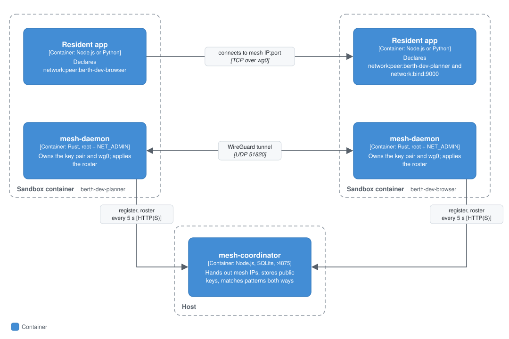

# Mesh networking

`network:peer:<name>` puts a resident app on a WireGuard mesh with apps in other sandboxes, so they can reach each other by a stable mesh IP without sharing a Docker network. Two apps are connected only when **both** name each other. Use it when apps in separate containers need to talk directly.

## Context

The mesh joins resident apps in separate sandboxes, each its own container under `berth dev`. A coordinator that you start on the host introduces them; after that, the apps reach each other directly by mesh IP. The kernel still decides which ports an app may listen on and connect to.

## Containers

<p align="center"></p>

### How it works

- **`mesh-coordinator`** (the host-side service) hands out mesh IPs, stores each peer's WireGuard public key, and decides who meets whom. A peer's roster only ever contains peers whose `network:peer:` patterns and its own match both ways.
- **`mesh-daemon`** runs in any container where an app declares `network:peer:`, and nowhere else. It generates a key pair, registers with the coordinator, brings up `wg0`, and every five seconds fetches its roster and applies it. It configures only the peers the coordinator returns.
- The kernel can't see WireGuard's UDP traffic per app, so **the coordinator's mutual match is the authorization boundary**. Declaring `network:peer:` also opens the coordinator's port to the app, and to no app that didn't declare it.
- The container gets `NET_ADMIN` and `/dev/net/tun` for the daemon. `agent-init` drops all capabilities before starting the app, so the app itself never has them.
- The daemon uses kernel WireGuard if the host has it, and otherwise falls back to the userspace `boringtun-cli` built into the image. Its boot log says which.
- If the coordinator is unreachable at boot, the mesh is off for that boot, with a warning; the app still starts. If it goes away later, the daemon keeps its last roster and existing tunnels keep working until it's back.
- The first registration of a name returns an owner token, which the daemon stores. Re-registering the name without it is refused, so nothing else can take over a peer's identity.

## Components

Inside the coordinator: mesh IP allocation from `100.64.0.0/10`, the store of public keys and hashes of owner tokens (SQLite), and the mutual pattern match that builds each peer's roster. Inside the daemon: key generation, registration, and the five-second loop that applies the roster to `wg0`. The details are in [How it works](#how-it-works); the settings are in [Configuration](#configuration).

## Code

### Using it

Each side names the other. The name to match is the peer's **container name**, which under `berth dev` is `berth-dev-<appName>`:

```yaml
# planner/berth.yml
name: planner
capabilities:
  - network:peer:berth-dev-browser
```

```yaml
# browser/berth.yml
name: browser
capabilities:
  - network:peer:berth-dev-planner
  - network:bind:9000      # to listen on a port
```

Start a coordinator, then run each app against it:

```bash
BERTH_MESH_COORDINATOR_HOST=0.0.0.0 npx -p @berthos/mesh-coordinator berth-mesh-coordinator   # listens on 4875

berth dev --mesh-coordinator=http://host.docker.internal:4875
```

Each container gets a mesh IP from `100.64.0.0/10`, kept for its name across restarts. Peers show up within about five seconds of both being registered.

Patterns may use `*` (`network:peer:berth-dev-*`, or `network:peer:*` for any name), but a peer still connects only if its own pattern matches this container back.

Listening needs `network:bind:<port>`, and connecting to a peer's port needs `network:connect:<port>`, as for any other network access. See [enforcement](./kernel-enforcement.md).

### Configuration

| Setting | Default | What it does |
|---|---|---|
| `berth dev --mesh-coordinator=<url>` | `http://host.docker.internal:4875` | Coordinator URL, passed to the container as `BERTH_MESH_COORDINATOR_URL` |
| `BERTH_MESH_COORDINATOR_PORT` | `4875` | Coordinator listen port |
| `BERTH_MESH_COORDINATOR_HOST` | `127.0.0.1` | Coordinator listen address. Containers usually can't reach loopback, so set `0.0.0.0` or a bridge address |
| `BERTH_MESH_COORDINATOR_DATA_DIR` | `./.berth-mesh-coordinator-data` | Where the coordinator keeps its SQLite database |
| `BERTH_MESH_COORDINATOR_TLS_CERT`, `_KEY` | unset | Serve HTTPS. See [TLS](./tls-reference.md) |
| `BERTH_MESH_LISTEN_PORT` | `51820` | WireGuard port inside the container |
| `BERTH_MESH_KEY_PATH` | `/run/berth/mesh/privatekey` | Where the daemon keeps its private key |
| `BERTH_MESH_TOKEN_PATH` | `/run/berth/mesh/owner-token` | Where the daemon keeps its owner token |

Only one app per container may declare `network:peer:` (one `wg0` per container). See [several apps in one sandbox](./multi-app-reference.md).

## What's deferred

- **Local `berth dev` only.** There's no mesh on Kubernetes, E2B or Daytona yet; E2B and Daytona don't guarantee the UDP it needs.
- **Plaintext by default.** Without the TLS settings, registration and the owner token travel over plain HTTP, so run the coordinator only where the network between it and your containers is trusted.
- **Identity is lost with the container.** The key and owner token live inside it. A container recreated under the same name can't re-register while the coordinator still holds the old token, and its mesh stays off for that boot.
- **The daemon runs as root with `NET_ADMIN`.** It confines its own file writes, but it isn't unprivileged. See the [roadmap](../ROADMAP.md#later).
- **`Crew.networked()` doesn't use this mesh.** It joins containers on a Docker network, and over a remote fleet it uses an HTTP bridge. See [networked crews](./agents-reference.md#networked-crew-agents-as-peers-on-a-real-lan).

The end-to-end tests are `packages/docker-orchestrator/test/mesh-milestone.mjs` and `mesh-coordinator-resilience-milestone.mjs`.
