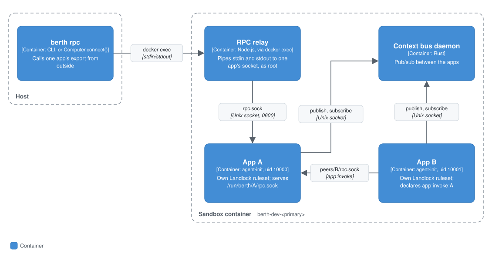

# Several apps in one sandbox

One sandbox can run several resident apps side by side. Each app keeps its own process, its own uid and its own kernel policy, so sharing a container never means sharing permissions. Use it when apps need to work together: through the [context bus](./context-bus-reference.md), through files in [`/context`](./semantic-fs-reference.md), or by calling each other's exports.

This page assumes you know what a [Berth OS](./berth-os-reference.md) and a [resident app](./resident-apps.md) are.

## Context

You start a multi-app sandbox from the CLI (`berth dev`, `berth test`, `berth deploy`, `berth os up`) by naming a primary app and its companions. Inside, the apps reach each other through the context bus, the semantic filesystem at `/context`, and each other's exports. The host, and anything driving it such as `berth rpc` or `Computer.connect()`, reaches each app's exports from outside. For how this sits among the rest of Berth, see the [README](../README.md#level-3-components-inside-a-sandbox).

## Containers

<p align="center"></p>

The sandbox is one container, named after the primary app (`berth-dev-<primary>`). Inside it, each app is its own process. The host talks to an app through a relay process, [`rpc-relay.js`](../packages/docker-orchestrator/docker/rpc-relay.js), that it starts with `docker exec` and that pipes its stdin and stdout to the app's socket.

### How it works

- At boot, each app runs its own `on_install`, gets its own policy compiled, and is started by its own `agent-init` with its own Landlock ruleset.
- Each app runs as its own uid (`10000` plus its position in the list).
- No app reads the container's stdin. Each gets its own RPC socket at `/run/berth/<app>/rpc.sock` instead, and the host reaches it through a small relay started with `docker exec`. That's what `berth rpc` and `Computer.connect()` use.
- Production builds (`berth test`, `berth deploy`, `berth os up`) stage each app into its own `apps/<name>/` directory in the image.

## Components

Inside the sandbox, what keeps apps apart when they call each other is the layout and ownership of their sockets.

### Calling another app's exports

An app can call a sibling's exports only if it declares `app:invoke:<name>`:

```yaml
capabilities:
  - app:invoke:notes
```

```
/run/berth/<app>/rpc.sock                  0600  <app>:<app>     the app itself, and root (the host relay)
/run/berth/<app>/peers/<caller>/rpc.sock   0660  <app>:<caller>  one authorized sibling, and nobody else
```

Declaring it gets the caller its own socket under the target's `peers/` directory, created at boot in a directory only the caller can enter. Without it, `connect(2)` fails with `EACCES`. Because each caller has its own socket, the target knows which app called it and logs that. Naming an app that isn't in the same container is a warning at boot, not an error.

The host isn't affected by any of this: the relay enters as root.

## Code

### Using it

Run from the primary app's directory and name the others with `--apps`:

```bash
cd apps/filesystem
berth dev --apps=apps/code-editor
```

`--apps` takes comma-separated paths relative to the pnpm workspace root. Each needs its own `berth.yml`. The primary app must be a pnpm workspace member.

`berth test --apps=...` and `berth deploy --fleet=<name> --apps=...` take the same flag. For a long-lived multi-app sandbox, use [`berth os up --apps=...`](./berth-os-reference.md), which takes paths relative to the current directory instead.

Call one app's export in a running multi-app container:

```bash
berth rpc code-editor --container=berth-dev-filesystem \
  --export=open_file --input='{"path":"/workspace/README.md"}'
```

The container is named after the primary app (`berth-dev-<primary>`), and `berth rpc` defaults to `berth-dev-<appName>`, so pass `--container` when calling a companion app.

The host side of the relay is `invokeAppExport()` in [`packages/docker-orchestrator/src/relay.ts`](../packages/docker-orchestrator/src/relay.ts).

## Limits

- **One of each shared resource per container.** Across all apps, at most one may declare `browser:*`, one `terminal:*`, one `network:peer:*`, and one `browser:navigate:*` or `network:host:*` (one display, one terminal port, one mesh interface, one egress proxy). `berth dev` and `berth os up` check all four before building. `berth test` and `berth deploy` check only `browser:*`, so a clash in the others shows up at runtime there.
- **`app:invoke:` grants a caller, not specific exports.** Once granted, the caller can reach every export the target has.

The end-to-end test is `packages/docker-orchestrator/test/multi-app-milestone.mjs`.
