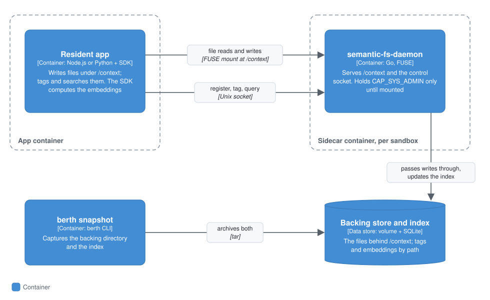

# Semantic FS

Semantic FS is a shared filesystem at `/context` whose files carry tags about why they exist: which app created them (`created_by`), what task they belong to (`task`), and which apps they relate to (`related_apps`). Apps can then find files by those tags ("files related to the auth bug") instead of by path. Use it for state that several apps, or several runs, need to find again.

The search looks at tags and paths only. It never reads file contents, and a file nobody tagged can only be found by words in its path or its creator's app name.

## Context

Semantic FS sits inside one sandbox. The resident apps there write ordinary files to `/context` and tag and search them; every app in the sandbox sees the same files. The experimental agent framework keeps its checkpoints, sessions and traces there, and [`berth snapshot`](./computer-snapshots-reference.md) carries `/context` from one sandbox to the next.

## Containers

<p align="center"></p>

### How it works

`semantic-fs-daemon` (Go) serves a FUSE filesystem at `$BERTH_CONTEXT_MOUNT` (default `/context`). Reads and writes pass straight through to a backing directory, and every write also updates a SQLite index keyed by path. Apps reach the daemon's control socket for `register`, `tag` and `query`, which needs no capability.

| Env var | Default |
|---|---|
| `BERTH_CONTEXT_MOUNT` | `/context` |
| `BERTH_CONTEXT_DATA` (backing directory) | `/var/berth/context-data` |
| `BERTH_CONTEXT_INDEX_DB` (tag index) | `/var/berth/context-index.db` |
| `BERTH_SEMANTIC_FS_SOCKET` (control socket) | `/tmp/berth-semantic-fs.sock` |

[`berth snapshot`](./computer-snapshots-reference.md) captures both the backing directory and the index.

#### Where the mount comes from, and how to have none

Mounting FUSE needs `CAP_SYS_ADMIN` and `/dev/fuse`. Set one of these on the host process that starts the sandbox (`berth dev`, `Computer.boot()` and so on) to choose who holds them:

| Posture | Selected by | `/context` | `CAP_SYS_ADMIN` and `/dev/fuse` |
|---|---|---|---|
| **Sidecar** (default) | Nothing | Mounted by a separate per-sandbox container and shared into the sandbox | Held by the sidecar only until its mount is up, then dropped. Never on the app container |
| **In-sandbox** | `BERTH_DISABLE_FS_SIDECAR=1` | Mounted by the daemon inside the app container | On the app container for its whole life, with a warning |
| **Off** | `BERTH_NO_SEMANTIC_FS=1` | Absent | Nowhere |

`BERTH_DISABLE_FS_SIDECAR=1` doesn't turn Semantic FS off; it moves the mount into the sandbox, which grants *more* privilege. To turn it off, use `BERTH_NO_SEMANTIC_FS=1`.

If the sidecar can't share its mount on this host (always the case on Docker Desktop for Mac), that boot runs with Semantic FS off and a warning naming both variables.

Off is never chosen for you when the sidecar works. The agent framework's checkpointing, sessions and traces rely on `/context` without any `berth.yml` line saying so, and with it off, those `/context` calls throw.

In a [microVM sandbox](./local-vm.md#limits) there is no sidecar: berth-init runs the same daemon inside the guest, `/context` is kept on the state disk with `/workspace`, and one embeddings daemon per sandbox ranks by meaning instead of a model in every app. See [the design](./design/microvm-semantic-fs.md).

## Components

Inside the daemon: a FUSE passthrough that records each file's creator, a SQLite tag index keyed by path, and the control socket's `register`, `tag` and `query` handlers. The embeddings themselves are computed by the SDK in the app; the daemon stores them and ranks against them.

### Query semantics — hybrid keyword + embedding similarity

Each file in the index is scored two ways against the query:

- **Keywords.** One point for each query word that appears (as a case-insensitive substring) in the file's path, `created_by`, `task` or `related_apps`.
- **Meaning.** The cosine similarity, between 0 and 1, of the query's embedding and the embedding stored when the file was tagged. Embeddings are computed from the tag text (`task`, `relatedApps` and path), never from file contents.

A file is returned if it has at least one keyword hit or a similarity of at least `0.2`. It's ranked by keyword points plus similarity, so **any keyword hit outranks a purely semantic match.** Exact names and authors win; files that only match by meaning rank among themselves by similarity.

The embedding model is `Xenova/all-MiniLM-L6-v2` (384 dimensions), run inside `@berthos/sdk`. Its weights are downloaded when the SDK is installed, never at runtime. If they're missing or fail to load, search falls back to keywords only and logs why.

## Code

### Using it from a resident app

Declare `/context` in `berth.yml`, like any other path:

```yaml
capabilities:
  - filesystem:read:/context
  - filesystem:write:/context
```

Then write ordinary files there, and tag and search them through `ctx.semanticFs`:

```ts
import { writeFile } from "node:fs/promises";
import { join } from "node:path";
import type { SemanticFsClient } from "@berthos/sdk";

let semanticFs: SemanticFsClient | undefined;

app.onAgentReady(async (ctx) => {
  await ctx.semanticFs.register({ app: "notes" });   // attributes this app's writes
  semanticFs = ctx.semanticFs;
});

app.export({
  name: "save_note",
  handler: async ({ path, content, task }) => {
    await writeFile(join("/context", path), content, "utf-8");   // created_by is recorded automatically
    await semanticFs!.tag(path, { task, relatedApps: ["code-editor"] });
  },
});

app.export({
  name: "find_notes",
  handler: async ({ text }) => ({ results: await semanticFs!.query(text, 5) }),
});
```

| Method | What it does |
|---|---|
| `register({ app })` | Call once in `onAgentReady`. Later writes through `/context` are attributed to this app as `created_by`. |
| `tag(path, { task?, relatedApps? })` | Attach tags to a file. `path` is relative to `/context`. Tagging again replaces the previous tags. |
| `query(text, limit?)` | Search tags and paths. Returns up to `limit` results (all matches if omitted), best first. |

Each result is `{ path, createdBy?, task?, relatedApps?, createdAt, updatedAt }`. Results carry metadata only, so read the file for its contents. `apps/filesystem` exposes all of this as the `write_context_file`, `read_context_file`, `tag_context_file` and `query_context` exports.

`created_by` is set on a file's first write and doesn't change when another app writes it later.

With the experimental agent framework, `createAgent({ retriever: "semantic-fs" })` wraps query-then-read into one `search_context` tool. See [retrieval](./agents-reference.md#retrieval-a-search_context-tool-over-semantic-fs-not-a-vector-db-integration).

#### When the daemon isn't there

- **Outside a sandbox** (a bare `node dist/index.js`, a unit test), `ctx.semanticFs` is a no-op and `query()` returns `[]`.
- **Inside a sandbox**, `tag()` and `query()` throw, so an outage never looks like "nothing matched". `register()` logs a warning and carries on, and that app's writes go unattributed.

## Limits

- **Not a content index.** Search sees tags and paths, never file contents, and untagged files have no embedding. Content search is on the [roadmap](../ROADMAP.md#later).
- **Shared by every app.** Any app with write access to `/context` can overwrite another app's files, and any app can tag any path. `created_by` records who wrote a file first; it doesn't protect it.
- **Every query scans the whole index.** There's no vector index or pagination, and `limit` only trims the results. That's fine for hundreds to low thousands of tagged files, not as a general document store.
- **The `0.2` threshold is tuned for short tag text.** Related tag strings score around `0.3` and unrelated ones around `0.04`. Long, sentence-like tags may need a different threshold.

The end-to-end test is `packages/docker-orchestrator/test/semantic-fs-milestone.mjs`.
